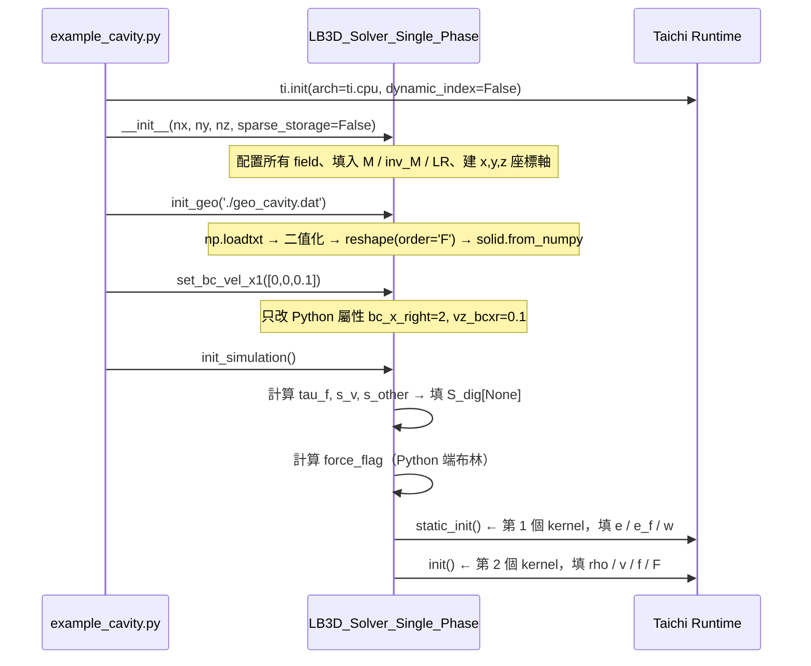
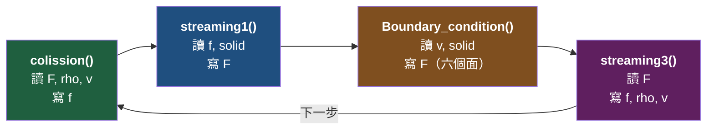
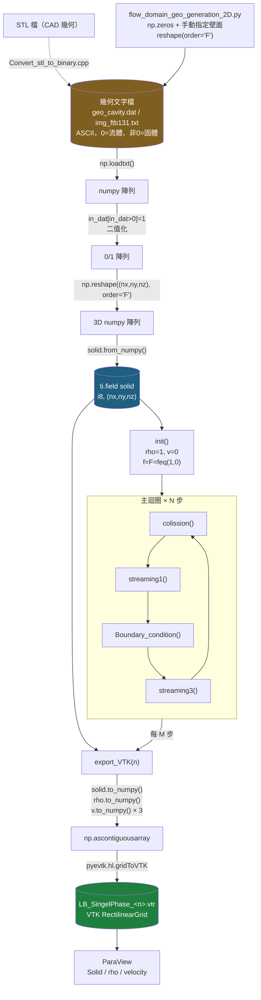

# taichi_LBM3D 程式架構與運行邏輯詳解（繁體中文）

> 本文件針對 repo `taichi_LBM3D`（Yang, Xu & Yang, *Fluids* **7**(8), 270, 2022）的全部 18 個 `.py` 檔（約 4 900 行）逐段解讀，
> 以**中文 pseudo code** 標註每個 kernel 內部的計算邏輯。
>
> 全文所引用的行號皆以 repo 當前 HEAD（commit `fe49e3f`）為準，並已逐一核對。
> 凡是「讀 code 無法百分之百確定」之處，一律明寫「**此處邏輯需進一步確認**」。

---

## 目錄

1. [全域鳥瞰](#1-全域鳥瞰)
2. [模組關係圖](#2-模組關係圖)
3. [資料結構總表](#3-資料結構總表)
4. [D3Q19 的離散速度與索引慣例](#4-d3q19-的離散速度與索引慣例)
5. [MRT 矩陣 M 的結構](#5-mrt-矩陣-m-的結構)
6. [初始化流程](#6-初始化流程)
7. [主迴圈逐步展開](#7-主迴圈逐步展開)
8. [邊界條件的完整邏輯](#8-邊界條件的完整邏輯)
9. [週期性索引 periodic_index()](#9-週期性索引-periodic_index)
10. [資料流：從輸入到輸出](#10-資料流從輸入到輸出)
11. [四個變體的差異](#11-四個變體的差異)
12. [已知問題與不一致](#12-已知問題與不一致)
13. [執行一次模擬的完整時序](#13-執行一次模擬的完整時序)
14. [附錄](#附錄-a三個子系統的主迴圈比較)

---

## 1. 全域鳥瞰

### 1.1 這個 repo 在做什麼

`taichi_LBM3D` 是一個用 **Taichi**（Python 內嵌式平行程式語言）寫的 **三維晶格波茲曼法**
（Lattice Boltzmann Method, LBM）求解器，採用 **D3Q19** 速度模型 ＋ **多鬆弛時間碰撞**
（Multi-Relaxation-Time, MRT）碰撞算子，主要設計目標是**多孔介質（porous medium）內的流動**。

所有物理量一律使用**晶格單位（lattice units）**；幾何以**均勻正交網格**描述，
由一個純文字檔（0 = 流體、1 = 固體）讀入。

### 1.2 四個子系統

| 子系統（資料夾） | 解決的問題 | 核心物理 | 代表檔案 |
|---|---|---|---|
| `Single_phase/` | 單相不可壓縮流：空腔驅動流、Poiseuille 流、岩心滲流 | MRT-LBM + Guo 外力 | `LBM_3D_SinglePhase_Solver.py` |
| `2phase/` | 兩相流（油／水驅替）：毛細管力主導 | 色梯度模型（colour-gradient / Rothman–Keller）＋ 接觸角 | `lbm_solver_3d_2phase.py` |
| `Grey_Scale/` | 次解析度（sub-resolution）多孔介質：灰階孔隙度 | Walsh–Sukop 部分反彈（partial bounce-back） | `lbm_solver_3d_Macro_Sukop.py` |
| `Phase_change/` | 固液相變（melting/solidification）＋ 自然對流 | 焓法（enthalpy method）雙分布函數 ＋ Boussinesq 浮力 | `LBM_3D_SinglePhase_Solute_Solver.py` |

### 1.3 檔案地圖：主力 vs 舊版

```
taichi_LBM3D/
├── README.md                    使用說明（參數意義、邊界條件編碼）
├── requirements.txt             taichi>=1.0.2（注意：pyevtk / evtk 沒列進去）
│
├── Single_phase/
│   ├── LBM_3D_SinglePhase_Solver.py      ★主力★ 529 行，class 化的求解器
│   ├── example_cavity.py                 39 行  範例：頂蓋驅動空腔流
│   ├── example_poiseuille_flow.py        53 行  範例：平板間 Poiseuille 流
│   ├── example_porous_medium.py          38 行  範例：砂岩滲流
│   ├── flow_domain_geo_generation_2D.py  30 行  幾何產生器 → geo_cavity.dat
│   ├── lbm_solver_3d.py                  339 行 ☆舊版☆ 非 class、腳本式
│   ├── lbm_solver_3d_cavity.py           323 行 ☆舊版☆ 腳本式、只有 X 方向 BC
│   ├── lbm_solver_3d_sparse.py           433 行 ☆舊版☆ 腳本式 + 稀疏儲存
│   ├── Convert_stl_to_binary.cpp         （C++，STL → 體素化，本文不涵蓋）
│   ├── geo_cavity.dat / img_ftb131.txt   幾何資料
│
├── 2phase/
│   ├── lbm_solver_3d_2phase.py           664 行  ★主力★（dense 儲存）
│   ├── lbm_solver_3d_2phase_sparse.py    666 行  同上，改用 ti.root.pointer
│   ├── img_ftb131.txt / phase_ftb131.dat 幾何 + 初始相場（值為 ±1）
│
├── Grey_Scale/
│   ├── lbm_solver_3d_Macro_Sukop.py      364 行  ★主力★
│   ├── flow_domain_geo_generation.py     27 行   幾何產生器
│   └── BC.dat                            60×50×5，值域 {0, 0.2, 1}（灰階！）
│
└── Phase_change/
    ├── LBM_3D_SinglePhase_Solver.py      528 行  Single_phase 主力的**複製分支**
    ├── LBM_3D_SinglePhase_Solute_Solver.py 561 行 ★主力★ 繼承上者，加溫度場
    ├── example_cavity_melting.py         63 行   範例：空腔熔化
    ├── example_phase_change.py           48 行   範例：相變
    ├── test1.py                          62 行   範例：等溫邊界 + 絕熱邊界
    ├── solute_psi_generation_2D.py       43 行   產生 geo_cavity.dat + psi.dat
    ├── read_img_solute_psi_generation_2D.py 57 行 從灰階圖 pic1.txt 產生同上
    └── pic1.txt                          167×218 的灰階影像
```

**哪些是主力、哪些是舊版：**

- `Single_phase/LBM_3D_SinglePhase_Solver.py` 是**唯一被 class 化**的版本，
  三個 `example_*.py` 都 `import` 它，是目前最該讀的檔案。
- `lbm_solver_3d.py`、`lbm_solver_3d_cavity.py`、`lbm_solver_3d_sparse.py` 是
  **早期腳本式版本**（README 的 To-do list 第一條正是「wrap functions into class」，
  且該條已對單相打勾）。它們把參數寫死在檔頭，一執行就直接跑完整個模擬迴圈。
- `Phase_change/LBM_3D_SinglePhase_Solver.py` 是 `Single_phase` 主力的**複製**，
  但**沒有同步**後來對 `tau_f` 與 Guo 外力的修改（詳見 §12.1）。
- `2phase/` 與 `Grey_Scale/` **完全沒有 class 化**，仍是腳本式（對應 To-do list 第二條）。

---

## 2. 模組關係圖

```mermaid
flowchart TD
    subgraph SP["Single_phase/ — 單相（已 class 化）"]
        EC["example_cavity.py<br/>50×50×50 頂蓋驅動"]
        EP["example_poiseuille_flow.py<br/>5×20×16 平板流"]
        EM["example_porous_medium.py<br/>131³ 砂岩"]
        SOLVER["LBM_3D_SinglePhase_Solver.py<br/><b>class LB3D_Solver_Single_Phase</b><br/>529 行"]
        GEN2D["flow_domain_geo_generation_2D.py"]
        GEO[("geo_cavity.dat<br/>img_ftb131.txt")]
        EC --> SOLVER
        EP --> SOLVER
        EM --> SOLVER
        GEN2D --> GEO
        GEO -->|init_geo / from_numpy| SOLVER
    end

    subgraph OLD["Single_phase/ — 舊版腳本（自成一體，無人 import）"]
        O1["lbm_solver_3d.py"]
        O2["lbm_solver_3d_cavity.py"]
        O3["lbm_solver_3d_sparse.py"]
    end

    subgraph PC["Phase_change/ — 相變"]
        PCBASE["LBM_3D_SinglePhase_Solver.py<br/>（Single_phase 的複製分支）"]
        SOLUTE["LBM_3D_SinglePhase_Solute_Solver.py<br/><b>class …_Solute(…_Single_Phase)</b>"]
        PE1["example_cavity_melting.py"]
        PE2["example_phase_change.py"]
        PE3["test1.py"]
        PGEN["solute_psi_generation_2D.py<br/>read_img_solute_psi_generation_2D.py"]
        PDAT[("geo_cavity.dat + psi.dat<br/>（需先跑產生器）")]
        PCBASE -->|繼承| SOLUTE
        PE1 --> SOLUTE
        PE2 --> SOLUTE
        PE3 --> SOLUTE
        PGEN --> PDAT
        PDAT --> SOLUTE
    end

    subgraph TP["2phase/ — 兩相（腳本式）"]
        T1["lbm_solver_3d_2phase.py"]
        T2["lbm_solver_3d_2phase_sparse.py"]
        TDAT[("img_ftb131.txt<br/>phase_ftb131.dat")]
        TDAT --> T1
        TDAT --> T2
    end

    subgraph GS["Grey_Scale/ — 灰階（腳本式）"]
        G1["lbm_solver_3d_Macro_Sukop.py"]
        GGEN["flow_domain_geo_generation.py"]
        GDAT[("BC.dat（含 0.2 灰階值）")]
        GGEN --> GDAT
        GDAT --> G1
    end

    SOLVER -.->|export_VTK| VTK[("*.vtr<br/>ParaView")]
    SOLUTE -.->|export_VTK| VTK
    O1 -.->|gridToVTK| VTK
    T1 -.->|gridToVTK| VTK
    G1 -.->|gridToVTK| VTK

    style SOLVER fill:#2d6cdf,color:#fff
    style SOLUTE fill:#2d6cdf,color:#fff
    style T1 fill:#2d6cdf,color:#fff
    style G1 fill:#2d6cdf,color:#fff
```



**重點：**只有 `Phase_change/LBM_3D_SinglePhase_Solute_Solver.py:8` 有跨檔 `import`
（`import LBM_3D_SinglePhase_Solver as lb3d`），其餘子系統之間**零耦合**——
每個資料夾都是各自獨立、互相複製貼上再改的分支。

---

## 3. 資料結構總表

### 3.1 `Single_phase/LBM_3D_SinglePhase_Solver.py` 的 taichi field

| 名稱 | 型別 | 形狀 | 物理意義 | 誰寫 | 誰讀 |
|---|---|---|---|---|---|
| `f` | `ti.Vector.field(19, f32)` | `(nx,ny,nz)` | 碰撞**後**的分布函數（post-collision） | `init`:168、`colission`:240-241、`streaming3`:379 | `streaming1`:266,268、`streaming3`:380,383 |
| `F` | `ti.Vector.field(19, f32)` | `(nx,ny,nz)` | 遷移**後**的分布函數（post-streaming） | `init`:169、`streaming1`:266,268、`Boundary_condition` 全部 | `colission`:226、`streaming3`:379 |
| `rho` | `ti.field(f32)` | `(nx,ny,nz)` | 密度 ρ（LBM 中 `p = ρ cs²`，所以也代表壓力） | `init`:165、`streaming3`:377,380,391 | `colission`:227、`feq`、`export_VTK` |
| `v` | `ti.Vector.field(3, f32)` | `(nx,ny,nz)` | 巨觀速度 **u** | `init`:166、`streaming3`:378,383,387-388,392 | `colission`:227,236、`Boundary_condition`、`cal_max_v` |
| `solid` | `ti.field(i8)` | `(nx,ny,nz)` | 固體標記：0 = 流體、>0 = 固體 | `init_geo`:177（`from_numpy`） | 幾乎所有 kernel |
| `e` | `ti.Vector.field(3, i32)` | `(19)` | 19 個離散速度（整數，用於索引位移） | `static_init`:183-187 | `feq`:154、`streaming1`:264 |
| `e_f` | `ti.Vector.field(3, f32)` | `(19)` | 同 `e`，但浮點版（用於動量求和與 Guo 力） | `static_init`:189-193 | `colission`:236、`streaming3`:383 |
| `w` | `ti.field(f32)` | `(19)` | D3Q19 權重 `w_k` | `static_init`:195-197 | `feq`:156、`colission`:236 |
| `LR` | **Python list**（非 field） | 長度 19 | 反向索引：`LR[s]` 是 `-e[s]` 的索引 | `__init__`:85 | `streaming1`:268 |
| `M` | `ti.Matrix.field(19,19,f32)` | `()` | MRT 轉換矩陣（分布函數 → 矩） | `__init__`:90-108 | `colission`:226,236 |
| `inv_M` | `ti.Matrix.field(19,19,f32)` | `()` | `M` 的反矩陣（矩 → 分布函數） | `__init__`:110 | `colission`:241 |
| `S_dig` | `ti.Vector.field(19,f32)` | `()` | 19 個鬆弛率的對角向量 | `init_simulation`:131 | `colission`:228,238 |
| `ext_f` | `ti.Vector.field(3,f32)` | `()` | 外力向量（**注意：實際計算並未使用它**，見 §12.7） | `init_simulation`:134-136 | 無（死變數） |
| `max_v` | `ti.field(f32)` | `()` | 全域最大速度大小（監控用） | `cal_max_v`:402 | `get_max_v`:397 |
| `x,y,z` | **numpy array** | `(nx),(ny),(nz)` | VTK 輸出用的座標軸 | `__init__`:112-114 | `export_VTK`:465-467 |

### 3.2 `Phase_change/…_Solute_Solver.py` 額外新增的 field

| 名稱 | 型別 | 形狀 | 物理意義 | 誰寫 | 誰讀 |
|---|---|---|---|---|---|
| `fg` | `ti.Vector.field(19,f32)` | `(nx,ny,nz)` | 溫度／焓分布函數（碰撞後） | `init_fg`:164、`colission_g`:211、`streaming3_g`:451、`BC_concentration` | `streaming1_g`:259 |
| `Fg` | `ti.Vector.field(19,f32)` | `(nx,ny,nz)` | 溫度分布函數（遷移後） | `init_fg`:165、`streaming1_g`:259、`BC_concentration` | `streaming3_g`:448,451 |
| `rho_T` | `ti.field(f32)` | `(nx,ny,nz)` | 溫度 T | `init_concentration`:473、`update_T_fl`:456 | `g_feq`、`cal_local_force`:188 |
| `rho_H` | `ti.field(f32)` | `(nx,ny,nz)` | 焓（enthalpy）H | `init_H`:156、`streaming3_g`:448 | `g_feq`、`update_T_fl`:456-457 |
| `rho_fl` | `ti.field(f32)` | `(nx,ny,nz)` | 液相分率（liquid fraction）f_l ∈ [0,1] | `init_fl`:170、`update_T_fl`:457-459 | `colission`:238、`colission_g`:199-200、`streaming3`:429 |
| `forcexyz` | `ti.Vector.field(3,f32)` | `(nx,ny,nz)` | 每格點的合力（含浮力），僅供輸出 | `streaming3`:422 | `export_VTK`:507-509 |

### 3.3 `2phase/lbm_solver_3d_2phase.py` 額外新增的 field

| 名稱 | 型別 | 形狀 | 物理意義 | 誰寫 | 誰讀 |
|---|---|---|---|---|---|
| `psi` | `ti.field(f32)` | `(nx,ny,nz)` | 相場（phase field）ψ ∈ [−1,1]；−1 = 相 1、+1 = 相 2 | `psi.from_numpy`:619、`streaming3`:605、`Boundary_condition_psi` | `Compute_C`:266、`Compute_S_local`:280-289 |
| `rho_r` | `ti.field(f32)` | `(nx,ny,nz)` | 紅相（red / phase 2）密度，當前步 | `init`:179、`streaming3`:594、`Boundary_condition_psi` | `colission`:271,345 |
| `rho_b` | `ti.field(f32)` | `(nx,ny,nz)` | 藍相（blue / phase 1）密度，當前步 | `init`:180、`streaming3`:595 | `colission`:271,346 |
| `rhor` | `ti.field(f32)` | `(nx,ny,nz)` | 紅相的**遷移累加暫存器** | `init`:181、`colission`:368,371、`streaming3`:596 | `streaming3`:594 |
| `rhob` | `ti.field(f32)` | `(nx,ny,nz)` | 藍相的遷移累加暫存器 | `init`:182、`colission`:369,372、`streaming3`:596 | `streaming3`:595 |

### 3.4 `Grey_Scale/lbm_solver_3d_Macro_Sukop.py` 額外新增的 field

| 名稱 | 型別 | 形狀 | 物理意義 | 誰寫 | 誰讀 |
|---|---|---|---|---|---|
| `ns` | `ti.field(f32)` | `(nx,ny,nz)` | 灰階固體分率 ∈ [0,1]，0 = 純流體、1 = 純固體 | `ns.from_numpy`:324 | `streaming0`:239 |
| `f2` | `ti.field(f32)` | `(nx,ny,nz,19)` | 部分反彈後的中間分布函數 | `streaming0`:239 | `streaming1`:248 |

---

## 4. D3Q19 的離散速度與索引慣例

### 4.1 `e` / `e_f`：19 個離散速度

`e`（整數版，用於 `i + e[s]` 的網格位移）與 `e_f`（浮點版，用於動量求和）
在 `static_init()` 中被設定成**完全相同的數值**
（`Single_phase/LBM_3D_SinglePhase_Solver.py:183-193`）。分開兩份純粹是為了避免
整數／浮點型別轉換。

| 索引 s | `e[s]` | 類別 | `w[s]` | `LR[s]`（反向） |
|---|---|---|---|---|
| 0 | (0, 0, 0) | 靜止 | 1/3 | 0 |
| 1 | (+1, 0, 0) | 軸向 | 1/18 | 2 |
| 2 | (−1, 0, 0) | 軸向 | 1/18 | 1 |
| 3 | (0, +1, 0) | 軸向 | 1/18 | 4 |
| 4 | (0, −1, 0) | 軸向 | 1/18 | 3 |
| 5 | (0, 0, +1) | 軸向 | 1/18 | 6 |
| 6 | (0, 0, −1) | 軸向 | 1/18 | 5 |
| 7 | (+1, +1, 0) | 面對角（XY） | 1/36 | 8 |
| 8 | (−1, −1, 0) | 面對角（XY） | 1/36 | 7 |
| 9 | (+1, −1, 0) | 面對角（XY） | 1/36 | 10 |
| 10 | (−1, +1, 0) | 面對角（XY） | 1/36 | 9 |
| 11 | (+1, 0, +1) | 面對角（XZ） | 1/36 | 12 |
| 12 | (−1, 0, −1) | 面對角（XZ） | 1/36 | 11 |
| 13 | (+1, 0, −1) | 面對角（XZ） | 1/36 | 14 |
| 14 | (−1, 0, +1) | 面對角（XZ） | 1/36 | 13 |
| 15 | (0, +1, +1) | 面對角（YZ） | 1/36 | 16 |
| 16 | (0, −1, −1) | 面對角（YZ） | 1/36 | 15 |
| 17 | (0, +1, −1) | 面對角（YZ） | 1/36 | 18 |
| 18 | (0, −1, +1) | 面對角（YZ） | 1/36 | 17 |

**索引慣例：**相反方向永遠是「**相鄰的一對**」——
`(1,2) (3,4) (5,6) (7,8) (9,10) (11,12) (13,14) (15,16) (17,18)`，
即 `LR = [0, 2,1, 4,3, 6,5, 8,7, 10,9, 12,11, 14,13, 16,15, 18,17]`
（`Single_phase/LBM_3D_SinglePhase_Solver.py:85`）。

> 已用程式驗證：對所有 s，`e[LR[s]] == -e[s]` 成立。
> 這個「偶數偏移配對」的性質正是 `2phase` 的 `colission()`（`lbm_solver_3d_2phase.py:352`）
> 能夠寫成 `for kk in ti.static([1,3,5,...,17])` 然後同時操作 `kk` 與 `kk+1` 的前提。

權重滿足 `Σ w_k = 1`（1/3 + 6×1/18 + 12×1/36 = 1/3 + 1/3 + 1/3 = 1），
而聲速平方 `cs² = 1/3`（這決定了 `feq` 中出現的 `3.0`、`4.5`、`1.5` 三個常數）。

### 4.2 平衡分布函數 `feq()`

```latex
f_k^{eq}(\rho, \mathbf{u}) \;=\; w_k\,\rho
\left[\,1 + 3(\mathbf{e}_k\!\cdot\!\mathbf{u})
       + \tfrac{9}{2}(\mathbf{e}_k\!\cdot\!\mathbf{u})^2
       - \tfrac{3}{2}\,\mathbf{u}\!\cdot\!\mathbf{u}\right]
```

```
函式 feq(k, rho_local, u):                     # LBM_3D_SinglePhase_Solver.py:152-158
    eu ← e[k] · u                               # 離散速度在流速方向上的投影
    uv ← u · u                                  # 速度大小平方
    回傳 w[k] * rho_local * (1 + 3*eu + 4.5*eu² − 1.5*uv)
    # 物理意義：Maxwell–Boltzmann 分布對小馬赫數做二階泰勒展開後的離散形式
```

---

## 5. MRT 矩陣 M 的結構

### 5.1 本 repo 使用的 M（19×19，整數）

```
M[0]  = [ 1, 1, 1, 1, 1, 1, 1, 1, 1, 1, 1, 1, 1, 1, 1, 1, 1, 1, 1]   → ρ（守恆）
M[1]  = [-1, 0, 0, 0, 0, 0, 0, 1, 1, 1, 1, 1, 1, 1, 1, 1, 1, 1, 1]   → 能量 e（此版特製）
M[2]  = [ 1,-2,-2,-2,-2,-2,-2, 1, 1, 1, 1, 1, 1, 1, 1, 1, 1, 1, 1]   → 能量平方 ε（此版特製）
M[3]  = [ 0, 1,-1, 0, 0, 0, 0, 1,-1, 1,-1, 1,-1, 1,-1, 0, 0, 0, 0]   → j_x = ρu_x（守恆）
M[4]  = [ 0,-2, 2, 0, 0, 0, 0, 1,-1, 1,-1, 1,-1, 1,-1, 0, 0, 0, 0]   → q_x（熱通量 x）
M[5]  → j_y（守恆）        M[6]  → q_y
M[7]  → j_z（守恆）        M[8]  → q_z
M[9]  = [ 0, 2, 2,-1,-1,-1,-1, 1,…,-2,-2,-2,-2]                      → 3p_xx（剪應力）
M[10] = [ 0,-2,-2, 1, 1, 1, 1, 1,…,-2,-2,-2,-2]                      → 3π_xx（高階）
M[11] = [ 0, 0, 0, 1, 1,-1,-1, 1, 1, 1, 1,-1,-1,-1,-1, 0,0,0,0]      → p_ww（剪應力）
M[12] = [ 0, 0, 0,-1,-1, 1, 1, 1, 1, 1, 1,-1,-1,-1,-1, 0,0,0,0]      → π_ww（高階）
M[13] → p_xy（剪應力）     M[14] → p_yz        M[15] → p_xz
M[16], M[17], M[18]        → m_x, m_y, m_z（ghost modes，三階矩）
```

（`Single_phase/LBM_3D_SinglePhase_Solver.py:64-82` 為 numpy 版、`:90-108` 為 taichi 版，
兩份內容完全一致，屬於重複定義。）

### 5.2 ⚠ 與教科書 d'Humières 版本的差異

**本 repo 的 row 1 與 row 2 與標準 d'Humières (2002) D3Q19 MRT 不同。**

| 矩 | d'Humières 標準值 | 本 repo | 差異 |
|---|---|---|---|
| **row 1**（能量 e） | `[-30, -11×6, 8×12]` | `[-1, 0×6, 1×12]` | **完全不同** |
| **row 2**（ε） | `[12, -4×6, 1×12]` | `[1, -2×6, 1×12]` | **完全不同** |
| row 3,5,7（j） | `[0, ±1, …]` | 同標準 | 相同 |
| row 4,6,8（q） | `[0, ∓2, …]` | 同標準 | 相同 |
| row 9–15 | 標準 | 同標準 | 相同 |
| row 16–18 | 標準 | 同標準 | 相同 |

**這造成兩個具體後果（皆經數值驗證）：**

1. **M 不再是正交矩陣。**標準 d'Humières 的 M 滿足 `M Mᵀ = diag(...)`。
   本 repo 的 M 有 8 對非正交列：

   ```
   (0,1) 內積 = 11     (0,2) = 1      (1,2) = 11
   (3,4) = 4           (5,6) = 4      (7,8) = 4
   (9,10) = 12         (11,12) = 4
   ```

   `inv_M` 因此必須靠 `np.linalg.inv(M_np)` 數值求逆
   （`LBM_3D_SinglePhase_Solver.py:83`），而非標準做法的 `Mᵀ D⁻¹`。
   `det(M) ≈ −6.115 × 10⁹`，矩陣可逆、數值上沒有病態問題。

2. **`meq_vec()` 是為這個特製的 M 量身訂做的。**
   已用 numpy 驗證：對 `ρ = 1`、任意小 `u`，`M @ feq(1, u)` 與
   `meq_vec(1, u)` **完全相等**（誤差 < 1e-16）。也就是說 row 1 被設計成
   在平衡態下恰好等於 `u·u`（而非標準的 `-11ρ + 19|j|²/ρ`）。

   ```
   函式 meq_vec(rho_local, u):                 # LBM_3D_SinglePhase_Solver.py:209-215
       out ← 19 維零向量
       out[0]  ← rho_local                      # 守恆：密度
       out[3]  ← u[0]                           # 守恆：x 動量（注意：不是 rho*u[0]！）
       out[5]  ← u[1]                           # 守恆：y 動量
       out[7]  ← u[2]                           # 守恆：z 動量
       out[1]  ← u · u                          # 能量矩 ≈ 動能
       out[9]  ← 2u_x² − u_y² − u_z²            # 偏應力 p_xx
       out[11] ← u_y² − u_z²                    # 偏應力 p_ww
       out[13] ← u_x·u_y                        # 剪應力 p_xy
       out[14] ← u_y·u_z                        # 剪應力 p_yz
       out[15] ← u_x·u_z                        # 剪應力 p_xz
       # 其餘（2,4,6,8,10,12,16,17,18）平衡值為 0 → 高階與 ghost modes 直接鬆弛到零
       回傳 out
   ```

   > **注意**：`meq[3] = u[0]` 而非 `rho*u[0]`。數值驗證顯示 `M @ feq(ρ,u)` 的第 3 分量
   > 確實是 `ρ·u_x`。因此當 `ρ ≠ 1` 時 `meq_vec` 與真實平衡矩有 `O((ρ−1)u)` 的偏差。
   > 對 index 3/5/7 無影響（其鬆弛率為 0，不參與鬆弛）；但 index 1、9、11、13、14、15
   > 的鬆弛率不為 0，此處引入的是**不可壓縮近似**（incompressible approximation）誤差。
   > 由於本 repo 的密度變化通常在 1.0 ± 0.005 之內，這個誤差實務上很小。

### 5.3 鬆弛率向量 `S_dig` 的配置

```python
# LBM_3D_SinglePhase_Solver.py:127-131
tau_f    = niu/3.0 + 0.5             # ← 見 §12.1，與其他六檔不同
s_v      = 1.0 / tau_f               # 剪應力相關鬆弛率
s_other  = 8.0*(2.0 - s_v)/(8.0 - s_v)   # 高階／ghost modes 鬆弛率（保證數值穩定）

S_dig = [0,      s_v,     s_v,     0,       s_other, 0,       s_other, 0,       s_other,
         s_v,    s_v,     s_v,     s_v,     s_v,     s_v,     s_v,     s_other, s_other, s_other]
# index: 0       1        2        3        4        5        6        7        8
#        9       10       11       12       13       14       15       16       17       18
```

| index | 矩 | 鬆弛率 | 說明 |
|---|---|---|---|
| 0 | ρ | **0** | 守恆量，不鬆弛 |
| 3, 5, 7 | j_x, j_y, j_z | **0** | 守恆量，不鬆弛 |
| 1 | e（能量／bulk） | `s_v` | ⚠ **與剪黏滯綁在一起**（見 §12.2） |
| 2 | ε | `s_v` | ⚠ 同上 |
| 4, 6, 8 | q_x, q_y, q_z | `s_other` | 熱通量（非物理的高階矩） |
| 9, 11, 13, 14, 15 | p_xx, p_ww, p_xy, p_yz, p_xz | `s_v` | **剪應力**，決定剪黏滯係數 |
| 10, 12 | π_xx, π_ww | `s_v` | ⚠ 高階矩卻綁在 `s_v` |
| 16, 17, 18 | m_x, m_y, m_z | `s_other` | ghost modes |

有效運動黏滯係數（kinematic viscosity）：

```latex
\nu_{\text{eff}} \;=\; c_s^2\left(\tau_f - \tfrac{1}{2}\right)
              \;=\; \tfrac{1}{3}\left(\tau_f - \tfrac{1}{2}\right)
```

### 5.4 鬆弛率的穩定性含義

`S_dig` 的每一個元素都必須落在 **(0, 2)** 開區間內，否則該矩會發散：

- `s = 0` → 完全不鬆弛（守恆量）。
- `0 < s < 1` → 欠鬆弛（under-relaxation），矩緩慢趨近平衡值 → 高黏滯、非常穩定。
- `s = 1` → 一步到位，直接設為平衡值（相當於 BGK 的 `τ = 1`）。
- `1 < s < 2` → 過鬆弛（over-relaxation），矩會**越過**平衡值再擺回來 → 低黏滯、
  接近高雷諾數；越靠近 2 越不穩定。
- `s ≥ 2` → 振幅逐步放大 → **必定發散**。

`s_other = 8(2 − s_v)/(8 − s_v)` 這個公式的設計目的：當 `s_v → 2`（極低黏滯）時，
`s_other → 0`；當 `s_v → 0`（極高黏滯）時，`s_other → 2`。
兩者呈現「一個逼近極限、另一個就退守」的互補關係，
這正是 TRT（Two-Relaxation-Time）理論中令**磁數（magic number）**
`Λ = (1/s_v − 1/2)(1/s_other − 1/2)` 保持常數的作法。
代入可驗證本 repo 的 `Λ = 3/16`，這個值能讓**半路反彈的固體壁表觀位置與黏滯係數無關**
（否則低黏滯時孔隙會「看起來」變寬，導致滲透率計算失真）。

實務上的參數選擇建議：

| 目標 | `niu`（其他六檔的標準式） | 得到的 `tau_f` | 得到的 `s_v` |
|---|---|---|---|
| 高黏滯、非常穩定（滲流） | 0.1 ~ 0.2 | 0.8 ~ 1.1 | 0.9 ~ 1.25 |
| 中等（一般用途） | 0.05 | 0.65 | 1.54 |
| 低黏滯、高 Re（危險） | 0.01 | 0.53 | 1.89 |
| 過低 → 發散 | < 0.003 | < 0.51 | > 1.96 |

同時必須維持**低馬赫數**條件：`|u| ≲ 0.1`（因為 `feq` 只展開到 `u` 的二階）。
`example_cavity.py` 的頂蓋速度 0.1 已經在這個上限。

---

## 6. 初始化流程

### 6.1 完整順序



### 6.2 `__init__()` — `LBM_3D_SinglePhase_Solver.py:11-115`

```
函式 __init__(nx, ny, nz, sparse_storage=False):
    # ---- (1) 預設物理參數 ----
    self.enable_projection ← True                 # 只是一個 ti.static() 的開關旗標
    self.nx, self.ny, self.nz ← nx, ny, nz
    self.fx, self.fy, self.fz ← 0, 0, 0           # 外力預設為零
    self.niu ← 0.16667                            # 預設運動黏滯係數

    # ---- (2) 六個面的邊界條件，全部預設為「週期」 ----
    對 面 ∈ {x_left, x_right, y_left, y_right, z_left, z_right}：
        bc_<面> ← 0                                # 0=週期, 1=定壓, 2=定速
        rho_bc<面> ← 1.0                           # 定壓模式用的密度值
        (vx,vy,vz)_bc<面> ← (0,0,0)                # 定速模式用的速度值

    # ---- (3) 主要 field 配置：dense 或 sparse ----
    若 sparse_storage == False：                   # 行 31-35
        f, F ← ti.Vector.field(19, f32, shape=(nx,ny,nz))   # 稠密：全網格都配記憶體
        rho  ← ti.field(f32, shape=(nx,ny,nz))
        v    ← ti.Vector.field(3, f32, shape=(nx,ny,nz))
    否則：                                         # 行 36-44
        n_mem_partition ← 3
        cell1 ← ti.root.pointer(ti.ijk, (nx//3+1, ny//3+1, nz//3+1))
        cell1.dense(ti.ijk, (3,3,3)).place(rho, v, f, F)
        # 物理意義：以 3×3×3 為單位的區塊，只有被寫入過的區塊才真正配記憶體
        #           對高孔隙率（大量固體）的岩心可省下大量記憶體

    # ---- (4) 小型常數 field（永遠是 dense）----
    e     ← ti.Vector.field(3, i32, shape=(19))    # 離散速度（整數）
    e_f   ← ti.Vector.field(3, f32, shape=(19))    # 離散速度（浮點）
    w     ← ti.field(f32, shape=(19))              # 權重
    S_dig ← ti.Vector.field(19, f32, shape=())     # 鬆弛率
    solid ← ti.field(i8, shape=(nx,ny,nz))         # 注意：即使 sparse 模式也是 dense！
    ext_f ← ti.Vector.field(3, f32, shape=())

    # ---- (5) MRT 矩陣 ----
    M_np ← 上述 19×19 整數矩陣（行 64-82）
    inv_M_np ← np.linalg.inv(M_np)                 # 行 83：numpy 數值求逆
    LR ← [0,2,1,4,3,6,5,8,7,10,9,12,11,14,13,16,15,18,17]   # 行 85：純 Python list
    M[None]     ← ti.Matrix([...])                 # 行 90-108：同樣的矩陣再寫一次
    inv_M[None] ← ti.Matrix(inv_M_np)              # 行 110

    # ---- (6) VTK 輸出用的座標軸 ----
    x ← np.linspace(0, nx, nx)                     # 行 112-114
    y ← np.linspace(0, ny, ny)                     # ⚠ 間距是 nx/(nx-1)，不是 1.0
    z ← np.linspace(0, nz, nz)
```

### 6.3 `init_geo(filename)` — `:173-177`

```
函式 init_geo(filename):
    in_dat ← np.loadtxt(filename)                  # 讀 ASCII 文字檔
    in_dat[in_dat > 0] ← 1                         # 二值化：任何非零值 → 1（固體）
                                                   # （img_ftb131.txt 的值是 0/255）
    in_dat ← np.reshape(in_dat, (nx,ny,nz), order='F')
    # order='F'（Fortran / column-major）：第一個索引 i 變化最快
    # 對應 README 的儲存順序：for k → for j → for i → geometry[i,j,k]
    solid.from_numpy(in_dat)                       # 拷貝到 taichi field（CPU→device）
```

> **注意**：`img_ftb131.txt` 實際上是 17 161 行 × 131 欄的**二維**表格
> （17161 = 131²，總元素 131³ = 2 248 091）。`np.loadtxt` 會回傳 shape `(17161,131)` 的
> 2-D 陣列，`np.reshape(…, order='F')` 會先以 column-major 把它攤平再重組。
> 這與「單欄 131³ 行」的攤平順序**不同**。此處的幾何方位是否符合原始影像，
> **需進一步確認**（但因 `example_porous_medium.py` 的岩心近乎各向同性，肉眼不易察覺）。

`example_poiseuille_flow.py:18-24` 示範了繞過 `init_geo()` 的做法——
直接用 numpy 建幾何再 `lb3d.solid.from_numpy(geometry)`。

### 6.4 `init_simulation()` — `:118-149`

```
函式 init_simulation():
    # (1) 把六個面的速度攤成 Python list（供 ti.Vector() 在 kernel 內展開）
    bc_vel_x_left  ← [vx_bcxl, vy_bcxl, vz_bcxl]        # 行 119-124
    …（其餘五個面同理）

    # (2) 由黏滯係數推導鬆弛率
    tau_f   ← niu/3.0 + 0.5                              # 行 127 ⚠ 見 §12.1
    s_v     ← 1.0 / tau_f                                # 剪應力鬆弛率
    s_other ← 8*(2 − s_v)/(8 − s_v)                      # 高階矩鬆弛率（TRT 型磁數關係）

    # (3) 填入 19 維鬆弛率向量
    S_dig[None] ← [0, s_v, s_v, 0, s_other, 0, s_other, 0, s_other,
                   s_v, s_v, s_v, s_v, s_v, s_v, s_v, s_other, s_other, s_other]

    # (4) 外力（注意：只寫進 ext_f field，但 colission 其實不讀它）
    ext_f[None][0..2] ← fx, fy, fz                       # 行 134-136

    # (5) 判斷是否需要計算 Guo 外力項（Python 端布林 → 編譯期常數）
    若 |fx|>0 或 |fy|>0 或 |fz|>0：force_flag ← 1
    否則                        ：force_flag ← 0          # 行 137-140

    ti.static(inv_M); ti.static(M); ti.static(S_dig)      # 行 143-146
    # ⚠ 這三行在 kernel 外呼叫 ti.static()，回傳值被丟棄 → 實際上是 no-op

    static_init()     # 行 148：第 1 個 kernel
    init()            # 行 149：第 2 個 kernel
```

### 6.5 `static_init()` — `:180-197`（@ti.kernel）

```
kernel static_init():
    若 ti.static(enable_projection)：      # 編譯期常數 True → 分支被完全展開，無執行期成本
        e[0..18]   ← 19 個離散速度（見 §4.1 表格）      # 行 183-187
        e_f[0..18] ← 同上，浮點版                       # 行 189-193
        w[0]       ← 1/3                                # 靜止方向
        w[1..6]    ← 1/18                               # 6 個軸向
        w[7..18]   ← 1/36                               # 12 個面對角
```

> 這個 kernel 沒有任何平行迴圈，是一連串的純量賦值；Taichi 會以「單一執行緒 kernel」編譯。

### 6.6 `init()` — `:160-169`（@ti.kernel）

```
kernel init():
    對每個格點 (i,j,k) ∈ solid 的索引空間 平行執行：      # 行 162
        若 (sparse_storage == False) 或 (solid[i,j,k] == 0)：   # 行 164
            # dense 模式：所有格點都初始化
            # sparse 模式：只有流體格點初始化 → 這一步同時「啟動」稀疏區塊
            rho[i,j,k] ← 1.0                              # 均勻初始密度
            v[i,j,k]   ← (0, 0, 0)                        # 靜止初始條件
            對 s = 0..18（ti.static 展開）：
                f[i,j,k][s] ← feq(s, 1.0, v[i,j,k])       # = w[s]（因為 u=0）
                F[i,j,k][s] ← feq(s, 1.0, v[i,j,k])       # f 與 F 都初始化為平衡態
```

**注意**：迴圈跑的是 `self.solid`（永遠 dense）而不是 `self.rho`。
在 sparse 模式下，這正是**啟動稀疏區塊**的機制——
只要某個 3×3×3 區塊內有任一流體格點被寫入，整個區塊就被配置。

---

## 7. 主迴圈逐步展開

```python
def step(self):                    # LBM_3D_SinglePhase_Solver.py:477-481
    self.colission()               # ① MRT 碰撞（含 Guo 外力）
    self.streaming1()              # ② 遷移 + 半路反彈
    self.Boundary_condition()      # ③ 六面邊界條件
    self.streaming3()              # ④ 巨觀量回算
```



### 7.1 `colission()` — MRT 碰撞 + Guo 外力（`:222-241`）

物理上這一步做三件事：把分布函數投影到矩空間、讓每個矩以各自的速率鬆弛到平衡值、
再投影回分布函數空間；若有外力，則在矩空間疊加 Guo 外力項。

```latex
\mathbf{m}   = \mathbf{M}\,\mathbf{f}
\qquad
\mathbf{m}^{*} = \mathbf{m} - \mathbf{S}\,(\mathbf{m}-\mathbf{m}^{eq})
                  + \left(\mathbf{I}-\tfrac{1}{2}\mathbf{S}\right)\mathbf{M}\,\mathbf{F}_{\!k}
\qquad
\mathbf{f}^{*} = \mathbf{M}^{-1}\mathbf{m}^{*}
```

```
kernel colission():
    對每個格點 (i, j, k) ∈ rho 的索引空間 平行執行：              # 行 224
        若 solid[i,j,k] == 0 且 i<nx 且 j<ny 且 k<nz：             # 行 225
            # ↑ 後三個條件只在 sparse 模式才有意義（區塊會超出 nx,ny,nz）

            m_temp ← M[None] @ F[i,j,k]                            # 行 226
            # 物理：把 19 個分布函數線性組合成 19 個「矩」
            #      （密度、動量、應力、熱通量、ghost modes…）

            meq ← meq_vec(rho[i,j,k], v[i,j,k])                    # 行 227
            # 物理：由當前巨觀量算出每個矩「應該是」的平衡值

            m_temp ← m_temp − S_dig[None] * (m_temp − meq)         # 行 228
            # 物理：逐矩鬆弛（element-wise），S_dig=0 的矩（ρ, j）原封不動保留
            #      S_dig 越大 → 鬆弛越快 → 黏滯越小

            f_local ← cal_local_force(i, j, k)                     # 行 229
            # 單相版：直接回傳常數 (fx, fy, fz)；相變版會加上浮力（見 §11.5）

            若 ti.static(force_flag == 1)：                        # 行 230（編譯期分支）
                對 s = 0..18：                                     # 行 231
                    f_guo ← 0
                    對 l = 0..18：                                 # 行 235
                        f_guo += w[l] * ( (e_f[l] − v[i,j,k])·f_local / 3.0
                                        + (e_f[l]·v[i,j,k]) * (e_f[l]·f_local) / 9.0 )
                                      * M[None][s, l]              # 行 236
                    # 物理：Guo (2002) 外力項，先在速度空間組出 F_l，
                    #      再乘 M 的第 s 列投影到矩空間
                    m_temp[s] += (1 − 0.5 * S_dig[None][s]) * f_guo  # 行 238
                    # 物理：(I − S/2) 因子消除外力造成的離散偏差（discrete lattice effect）

            f[i,j,k] ← 19 維零向量                                 # 行 240
            f[i,j,k] += inv_M[None] @ m_temp                       # 行 241
            # 物理：投影回分布函數空間，得到碰撞後的 f*
```

> **關於 Guo 外力係數**：標準 Guo 公式是
> `F_l = w_l [ (e_l − u)/cs² + (e_l·u)e_l/cs⁴ ] · F`，
> 在 `cs² = 1/3` 下係數應為 **3** 與 **9**。本檔用的是 **1/3** 與 **1/9**
> （即標準值的 1/9）。數值驗證：實際注入的動量是 `F/9`，不是 `F`。
> 這與 §12.1 的 `tau_f = niu/3+0.5` **互相抵消**，詳見 §12.1 的完整分析。

### 7.2 `streaming1()` — 遷移 + 半路反彈（`:259-268`）

```
kernel streaming1():
    對每個格點索引向量 i ∈ grouped(rho) 平行執行：                # 行 261
        若 solid[i] == 0 且 i.x<nx 且 i.y<ny 且 i.z<nz：          # 行 262
            對 s = 0..18（ti.static 展開）：                       # 行 263
                ip ← periodic_index(i + e[s])                     # 行 264
                # 物理：沿方向 s 的鄰居格點（超出邊界則週期折返）

                若 solid[ip] == 0：                               # 行 265
                    F[ip][s] ← f[i][s]                            # 行 266
                    # 物理：正常遷移 —— 粒子從 i 飛到鄰居 ip，方向不變
                否則：
                    F[i][LR[s]] ← f[i][s]                         # 行 268
                    # 物理：半路反彈（halfway bounce-back）
                    #      粒子撞到固體壁，原地掉頭回到自己，方向變成 LR[s]
                    #      這實現了牆面上的 no-slip（無滑移）條件
```

**寫入衝突分析（為何不需要原子操作）：**
對固定的 `(ip, s)`，只有唯一一個來源格點 `i = ip − e[s]` 會寫 `F[ip][s]`；
而反彈分支寫的 `F[i][LR[s]]`，其「正常遷移」的來源會是 `i + e[s] = ip`，
但那個 `ip` 是固體、不會執行迴圈。因此兩個分支的寫入目標**互斥**，
不會產生 race condition。

### 7.3 `Boundary_condition()` — 見 §8

### 7.4 `streaming3()` — 巨觀量回算（`:372-392`）

```latex
\rho = \sum_{k=0}^{18} f_k, \qquad
\mathbf{u} = \frac{1}{\rho}\sum_{k=0}^{18} \mathbf{e}_k f_k + \frac{\mathbf{F}}{2\rho}
```

```
kernel streaming3():
    對每個格點索引向量 i ∈ grouped(rho) 平行執行：                # 行 374
        若 solid[i] == 0 且 i.x<nx 且 i.y<ny 且 i.z<nz：          # 行 376
            rho[i] ← 0                                            # 行 377
            v[i]   ← (0, 0, 0)                                    # 行 378
            f[i]   ← F[i]                                         # 行 379（整個 19 維向量複製）
            rho[i] += f[i].sum()                                  # 行 380
            # 物理：零階矩 = 密度（也就是壓力，p = rho/3）

            對 s = 0..18：
                v[i] += e_f[s] * f[i][s]                          # 行 383
            # 物理：一階矩 = 動量 rho*u

            f_local ← cal_local_force(i.x, i.y, i.z)              # 行 385
            v[i] ← v[i] / rho[i]                                  # 行 387：動量 → 速度
            v[i] += (f_local / 2) / rho[i]                        # 行 388
            # 物理：Guo 外力方案要求速度含半步外力修正，
            #      否則會有 O(F) 的系統偏差
        否則：
            rho[i] ← 1.0                                          # 行 391：固體格點填假值
            v[i]   ← (0, 0, 0)                                    # 行 392：固體速度為零
            # 目的：讓 VTK 輸出時固體區域不是垃圾值，也讓邊界條件
            #      引用固體鄰居的 v 時得到 no-slip 的 0
```

> **注意**：`f[i] = F[i]`（行 379）純粹是把 `F` 當暫存複製到 `f`；但下一步的
> `colission()` 讀的是 `F` 而不是 `f`，且 `colission()` 會完整覆寫 `f`。
> 因此這次複製對後續計算沒有影響，屬於**多餘的記憶體寫入**（見 §12.9）。

---

## 8. 邊界條件的完整邏輯

`Boundary_condition()`（`LBM_3D_SinglePhase_Solver.py:272-370`，約 100 行）
是整個求解器中最長的 kernel。它的結構是
**6 個面 × 2 種顯式類型（定壓 / 定速）= 12 個獨立的 `ti.static()` 分支**。

### 8.1 三種邊界類型的編碼

| `bc_*` 值 | 類型 | 實作方式 | 需要的額外參數 |
|---|---|---|---|
| **0** | 週期（periodic） | **在此 kernel 中完全不做事**；由 `streaming1()` 裡的 `periodic_index()` 自動達成 | 無 |
| **1** | 定壓（fixed pressure） | 把該面所有 19 個分布函數重設為 `feq(s, rho_bc, u_ref)` | `rho_bc*`（密度值，`p = ρ/3`） |
| **2** | 定速（fixed velocity） | 把該面所有 19 個分布函數重設為 `feq(s, 1.0, v_bc)` | `vx_bc*, vy_bc*, vz_bc*` |

**關鍵觀念**：`ti.static(self.bc_x_left==1)` 是**編譯期**判斷。
Taichi 在第一次呼叫此 kernel 時把 Python 端的 `self.bc_x_left` 讀成常數，
不符合的分支會被**完全編譯掉**，因此週期邊界（值為 0）的執行期成本是**零**。
代價是：**`init_simulation()` 之後再改 `bc_*` 不會生效**（見 §12.5）。

### 8.2 X 方向左面（i = 0）

```
# ---------- bc_x_left == 1（定壓）----------   行 274-281
若 ti.static(bc_x_left == 1)：
    對 (j, k) ∈ ndrange((0,ny), (0,nz)) 平行執行：
        若 solid[0,j,k] == 0：                       # 只處理流體格點
            對 s = 0..18：
                若 solid[1,j,k] > 0：                # 內側鄰居是固體
                    F[0,j,k][s] ← feq(s, rho_bcxl, v[1,j,k])
                    # v[1,j,k] 被 streaming3 設為 0 → 等效於「定壓 + 無滑移」
                否則：                                # 內側鄰居是流體
                    F[0,j,k][s] ← feq(s, rho_bcxl, v[0,j,k])
                    # 用邊界格點自己上一步的速度 → 速度「外推」、只強制密度
                    # 物理：這是 Zou–He 型「壓力給定、速度自由」的平衡態近似

# ---------- bc_x_left == 2（定速）----------   行 283-288
若 ti.static(bc_x_left == 2)：
    對 (j, k) ∈ ndrange((0,ny), (0,nz)) 平行執行：
        若 solid[0,j,k] == 0：
            對 s = 0..18：
                F[0,j,k][s] ← feq(s, 1.0, ti.Vector(bc_vel_x_left))
                # 物理：直接把整個分布函數設為給定速度的平衡態
                #      密度固定寫死 1.0（不用局部密度）
                # 注意：行 287 的註解保留了「反彈 + 平衡」的舊寫法（見 §11.1）
```

### 8.3 X 方向右面（i = nx−1）

```
# ---------- bc_x_right == 1（定壓）----------  行 290-297
若 ti.static(bc_x_right == 1)：
    對 (j, k) ∈ ndrange((0,ny), (0,nz)) 平行執行：
        若 solid[nx-1, j, k] == 0：
            對 s = 0..18：
                若 solid[nx-2, j, k] > 0：
                    F[nx-1,j,k][s] ← feq(s, rho_bcxr, v[nx-2,j,k])
                否則：
                    F[nx-1,j,k][s] ← feq(s, rho_bcxr, v[nx-1,j,k])

# ---------- bc_x_right == 2（定速）----------  行 299-304
若 ti.static(bc_x_right == 2)：
    對 (j, k) ∈ ndrange((0,ny), (0,nz)) 平行執行：
        若 solid[nx-1, j, k] == 0：
            對 s = 0..18：
                F[nx-1,j,k][s] ← feq(s, 1.0, ti.Vector(bc_vel_x_right))
```

### 8.4 Y 方向左面 / 右面（j = 0 / j = ny−1）

```
# ---------- bc_y_left == 1 ----------          行 307-314
若 ti.static(bc_y_left == 1)：
    對 (i, k) ∈ ndrange((0,nx), (0,nz)) 平行執行：
        若 solid[i,0,k] == 0：
            對 s = 0..18：
                若 solid[i,1,k] > 0：  F[i,0,k][s] ← feq(s, rho_bcyl, v[i,1,k])
                否則：                 F[i,0,k][s] ← feq(s, rho_bcyl, v[i,0,k])

# ---------- bc_y_left == 2 ----------          行 316-321
若 ti.static(bc_y_left == 2)：
    對 (i, k) ∈ ndrange((0,nx), (0,nz)) 平行執行：
        若 solid[i,0,k] == 0：
            對 s = 0..18：  F[i,0,k][s] ← feq(s, 1.0, ti.Vector(bc_vel_y_left))

# ---------- bc_y_right == 1 ----------         行 323-330
若 ti.static(bc_y_right == 1)：
    對 (i, k) ∈ ndrange((0,nx), (0,nz)) 平行執行：
        若 solid[i, ny-1, k] == 0：
            對 s = 0..18：
                若 solid[i, ny-2, k] > 0：  F[i,ny-1,k][s] ← feq(s, rho_bcyr, v[i,ny-2,k])
                否則：                      F[i,ny-1,k][s] ← feq(s, rho_bcyr, v[i,ny-1,k])

# ---------- bc_y_right == 2 ----------         行 332-337
若 ti.static(bc_y_right == 2)：
    對 (i, k) ∈ ndrange((0,nx), (0,nz)) 平行執行：
        若 solid[i, ny-1, k] == 0：
            對 s = 0..18：  F[i,ny-1,k][s] ← feq(s, 1.0, ti.Vector(bc_vel_y_right))
```

### 8.5 Z 方向左面 / 右面（k = 0 / k = nz−1）

```
# ---------- bc_z_left == 1 ----------          行 340-347
若 ti.static(bc_z_left == 1)：
    對 (i, j) ∈ ndrange((0,nx), (0,ny)) 平行執行：
        若 solid[i,j,0] == 0：
            對 s = 0..18：
                若 solid[i,j,1] > 0：  F[i,j,0][s] ← feq(s, rho_bczl, v[i,j,1])
                否則：                 F[i,j,0][s] ← feq(s, rho_bczl, v[i,j,0])

# ---------- bc_z_left == 2 ----------          行 349-354
若 ti.static(bc_z_left == 2)：
    對 (i, j) ∈ ndrange((0,nx), (0,ny)) 平行執行：
        若 solid[i,j,0] == 0：
            對 s = 0..18：  F[i,j,0][s] ← feq(s, 1.0, ti.Vector(bc_vel_z_left))

# ---------- bc_z_right == 1 ----------         行 356-363
若 ti.static(bc_z_right == 1)：
    對 (i, j) ∈ ndrange((0,nx), (0,ny)) 平行執行：
        若 solid[i, j, nz-1] == 0：
            對 s = 0..18：
                若 solid[i, j, nz-2] > 0：  F[i,j,nz-1][s] ← feq(s, rho_bczr, v[i,j,nz-2])
                否則：                      F[i,j,nz-1][s] ← feq(s, rho_bczr, v[i,j,nz-1])

# ---------- bc_z_right == 2 ----------         行 365-370
若 ti.static(bc_z_right == 2)：
    對 (i, j) ∈ ndrange((0,nx), (0,ny)) 平行執行：
        若 solid[i, j, nz-1] == 0：
            對 s = 0..18：  F[i,j,nz-1][s] ← feq(s, 1.0, ti.Vector(bc_vel_z_right))
```

### 8.6 對稱性總結表

| 面 | 迴圈維度 | 邊界層索引 | 內側鄰居索引 | 定壓參數 | 定速參數 |
|---|---|---|---|---|---|
| X left | `(j,k)` over `(ny,nz)` | `[0,j,k]` | `[1,j,k]` | `rho_bcxl` | `bc_vel_x_left` |
| X right | `(j,k)` over `(ny,nz)` | `[nx-1,j,k]` | `[nx-2,j,k]` | `rho_bcxr` | `bc_vel_x_right` |
| Y left | `(i,k)` over `(nx,nz)` | `[i,0,k]` | `[i,1,k]` | `rho_bcyl` | `bc_vel_y_left` |
| Y right | `(i,k)` over `(nx,nz)` | `[i,ny-1,k]` | `[i,ny-2,k]` | `rho_bcyr` | `bc_vel_y_right` |
| Z left | `(i,j)` over `(nx,ny)` | `[i,j,0]` | `[i,j,1]` | `rho_bczl` | `bc_vel_z_left` |
| Z right | `(i,j)` over `(nx,ny)` | `[i,j,nz-1]` | `[i,j,nz-2]` | `rho_bczr` | `bc_vel_z_right` |

### 8.7 使用者介面：12 個 setter

```python
set_bc_vel_x0/x1/y0/y1/z0/z1(vel)   # :405-427  → 設 bc_* = 2 並填入速度三分量
set_bc_rho_x0/x1/y0/y1/z0/z1(rho)   # :429-451  → 設 bc_* = 1 並填入密度值
```

`example_cavity.py:15` 的 `lb3d.set_bc_vel_x1([0.0, 0.0, 0.1])`
就是把 X 右面設成「以 z 方向 0.1 晶格速度滑動的頂蓋」。

---

## 9. 週期性索引 `periodic_index()`

```
函式 periodic_index(i):                # LBM_3D_SinglePhase_Solver.py:247-257
    iout ← i                            # 複製輸入向量（3 分量整數）

    若 i[0] < 0      ： iout[0] ← nx − 1     # x 越過左界 → 折到最右
    若 i[0] > nx − 1 ： iout[0] ← 0          # x 越過右界 → 折到最左
    若 i[1] < 0      ： iout[1] ← ny − 1     # y 同理
    若 i[1] > ny − 1 ： iout[1] ← 0
    若 i[2] < 0      ： iout[2] ← nz − 1     # z 同理
    若 i[2] > nz − 1 ： iout[2] ← 0

    回傳 iout
```

**幾個關鍵性質：**

1. **只處理「剛好超出一格」的情形。**因為 D3Q19 的所有 `e[s]` 分量都只有 `{−1, 0, +1}`，
   `i + e[s]` 最多只會超出邊界 1 格，所以直接指定端點即可，不需要取模運算
   （`%` 在 GPU 上遠慢於分支）。
2. **三個軸各自獨立折返。**角落格點（例如 `(-1,-1,-1)`）會同時在三個方向折返到
   `(nx-1, ny-1, nz-1)`，正確處理了 3D 週期性。
3. **無條件週期。**`periodic_index()` **不看** `bc_x_left` 等設定——
   `streaming1()` 永遠以週期方式遷移。非週期邊界是靠**事後覆寫**
   （`Boundary_condition()` 把邊界層的 19 個 `F` 全部重設）來實現的。
   這是一個重要的架構決策：遷移核心保持極簡，所有邊界特殊性集中在一個 kernel。
4. **效能**：6 個獨立的 `if`，在 Taichi 中會編譯成無分支的 `select` 指令，
   GPU 上不會造成 warp divergence。

### 9.1 `2phase` 的變體：`periodic_index_for_psi()`

兩相求解器多了一個專給**相場**用的折返函式（`lbm_solver_3d_2phase.py:390-428`）：

```
函式 periodic_index_for_psi(i):
    iout ← i
    若 i[0] < 0：
        若 bc_psi_x_left == 0： iout[0] ← nx − 1     # 週期：折到另一端
        否則：                  iout[0] ← 0          # 定值：夾在邊界上（Neumann 式）
    若 i[0] > nx − 1：
        若 bc_psi_x_right == 0： iout[0] ← 0
        否則：                   iout[0] ← nx − 1
    …（y、z 方向同理，各自看自己的 bc_psi_* 旗標）
    回傳 iout
```

物理意義：當相場邊界是「定值」時，取相場梯度（`Compute_C`）不應該把
另一端的相場值拉進來，而應該**夾住（clamp）**在邊界格點上，
等同於在邊界外側複製一份相同的 ψ，即零梯度（zero-gradient）延拓。

---

## 10. 資料流：從輸入到輸出



### 10.1 `export_VTK()` 的細節（`:462-475`）

```
函式 export_VTK(n):
    gridToVTK(
        "./LB_SingelPhase_" + str(n),          # 檔名（注意原始碼的 "Singel" 拼字錯誤）
        x, y, z,                                # 三個 1D 座標軸陣列（RectilinearGrid）
        pointData = {
            "Solid":    solid.to_numpy()   → ascontiguousarray,    # 行 469
            "rho":      rho.to_numpy()     → ascontiguousarray,    # 行 470
            "velocity": ( v.to_numpy()[:nx,:ny,:nz, 0],            # 行 471
                          v.to_numpy()[:nx,:ny,:nz, 1],            # 行 472
                          v.to_numpy()[:nx,:ny,:nz, 2] )           # 行 473
                        # ⚠ v.to_numpy() 被呼叫三次 → 三份完整拷貝（見 §12.3）
        })
```

輸出的檔案格式為 `.vtr`（VTK Rectilinear Grid），可直接拖進 ParaView：
- `Solid` → 用 Threshold 濾掉固體，或用 Contour 畫出孔隙表面
- `rho` → 壓力場（`p = ρ/3`）
- `velocity` → 三分量向量場，可畫流線（Stream Tracer）或速度大小

---

## 11. 四個變體的差異

### 11.1 舊版腳本 vs class 化主力（`lbm_solver_3d*.py`）

| 面向 | `LBM_3D_SinglePhase_Solver.py`（主力） | `lbm_solver_3d.py` / `_cavity.py` / `_sparse.py`（舊版） |
|---|---|---|
| 程式結構 | `@ti.data_oriented class`，所有狀態放 `self.` | 模組層級全域變數 + 全域函式 |
| `ti.init()` | 由呼叫端的 example 負責 | 寫死在檔頭（`:6` / `:7` / `:8`） |
| 參數設定 | 12 個 setter 方法 | 直接改檔頭的全域變數 |
| 主迴圈 | 呼叫端的 `for` 迴圈呼叫 `step()` | 檔案末尾直接寫死迴圈 |
| `f` / `F` 佈局 | `ti.Vector.field(19)` → SoA-of-vector | `lbm_solver_3d.py` 用 `ti.field(shape=(nx,ny,nz,19))`；`_cavity.py` 用 Vector.field |
| `M @ f` | 用 `ti.Matrix` 的 `@` 運算子 | `lbm_solver_3d.py` / `_sparse.py` 用手寫 `multiply_M()` 雙層迴圈（`:164-170` / `:188-194`） |
| `LR` | Python list（編譯期常數） | `lbm_solver_3d.py` / `_sparse.py` 用 `ti.field(i32, shape=(19))`（執行期查表） |
| 定速邊界 | `feq(s, 1.0, v_bc)`（平衡態法） | `feq(LR[s],1,v)−F[LR[s]]+feq(s,1,v)`（反彈 + 平衡法，Zou–He 型） |
| 邊界覆蓋面 | 六個面全部實作 | `lbm_solver_3d.py` / `_cavity.py` **只實作 X 方向兩個面**（Y、Z 永遠週期） |
| 外力 | `force_flag` 決定是否計算 | `lbm_solver_3d.py` / `_sparse.py` **無條件計算**（即使外力為零也跑 19×19 迴圈） |
| Guo 係數 | `/3.0` 與 `/9.0`（見 §12.1） | 無除法（係數 1 與 1） |
| `tau_f` | `niu/3.0 + 0.5` | `3.0*niu + 0.5` |
| `streaming2()` | 不存在 | 有定義但被註解掉沒呼叫（`lbm_solver_3d.py:232-236`） |

### 11.2 `_sparse` 版本的稀疏儲存機制

**主力 class 的 sparse 模式**（`LBM_3D_SinglePhase_Solver.py:36-49`）：

```
若 sparse_storage == True：
    n_mem_partition ← 3
    cell1 ← ti.root.pointer(ti.ijk, (nx//3+1, ny//3+1, nz//3+1))
    #         ↑ 一層 pointer SNode：每個「元素」是一個指標，預設為 null
    cell1.dense(ti.ijk, (3,3,3)).place(rho, v, f, F)
    #         ↑ 每個指標指向一個 3×3×3 的稠密區塊，四個 field 共用同一個區塊結構

    # 記憶體語意：
    #   - 一開始所有指標都是 null，佔用 = (nx/3)×(ny/3)×(nz/3) × 8 bytes
    #   - 當 kernel 第一次「寫入」某格點，Taichi 自動 malloc 整個 3×3×3 區塊
    #   - 讀取未啟動的區塊回傳零值（不會 crash）
    #   - for i,j,k in rho 只會迭代「已啟動」的區塊
```

**「啟動」發生在 `init()`**（`:162-169`）：迴圈跑 `self.solid`（永遠 dense），
只對 `solid==0` 的格點寫入 → 只有含流體的 3×3×3 區塊被配置。
對孔隙率 20 % 的砂岩，理論上可省下 60–70 % 的 `f`/`F` 記憶體
（實際比例取決於孔隙的空間聚集程度，因為只要區塊內有一格是流體，整塊就要配）。

**代價**：所有 kernel 的迴圈都必須加上 `i<nx and j<ny and k<nz` 的守衛
（`colission():225`、`streaming1():262`、`streaming3():376`），
因為區塊邊界會超出真實網格（`nx//3+1` 的無條件進位）。

**舊版 `lbm_solver_3d_sparse.py` 的差異**（`:52-58`）：

```
cell1 ← ti.root.pointer(ti.ijk, (nx//3+1, ny//3+1, nz//3+1))
cell1.dense(ti.ijk, (3,3,3)).place(rho)       # rho 一個區塊
cell1.dense(ti.ijk, (3,3,3)).place(v)         # v 另一個區塊（分開 place）

cell2 ← ti.root.pointer(ti.ijkl, (nx//3+1, ny//3+1, nz//3+1, 1))   # 四維 SNode！
cell2.dense(ti.ijkl, (3,3,3,19)).place(f)
cell2.dense(ti.ijkl, (3,3,3,19)).place(F)
# 差異：f/F 用 (i,j,k,s) 四維索引的 scalar field，而非 19 維 Vector.field
```

### 11.3 `2phase`：色梯度兩相模型

新增的物理成分：

| 成分 | 參數 | 檔頭行號 | 意義 |
|---|---|---|---|
| 兩相黏滯 | `niu_l = 0.1`, `niu_g = 0.1` | `:21-22` | ψ>0 為液相、ψ<0 為氣相（或第二相） |
| 接觸角 | `psi_solid = 0.7` | `:23` | **接觸角的餘弦值**，範圍 −1 ~ 1 |
| 界面張力 | `CapA = 0.005` | `:24` | 控制毛細管力強度 |
| 相場邊界 | `bc_psi_*`, `psi_*` | `:34-39` | 0 = 週期、1 = 定值（−1 或 +1） |

**(a) 雙相黏滯的插值**（`Compute_S_local`，`:278-299`）：

```
函式 Compute_S_local(id):
    # 預先算好（檔頭 :102-108）：
    #   wl  = 1/(3*niu_l + 0.5)        液相鬆弛率
    #   wg  = 1/(3*niu_g + 0.5)        氣相鬆弛率
    #   lg0 = 2*wl*wg/(wl+wg)          界面處的調和平均
    #   l1  = 2*(wl−lg0)*10,  l2 = −l1/0.2
    #   g1  = 2*(lg0−wg)*10,  g2 =  g1/0.2

    若 psi[id] > 0：                           # 液相側
        若 psi[id] > 0.1：  sv ← wl            # 純液相，用液相鬆弛率
        否則：              sv ← lg0 + l1*psi + l2*psi²
                                               # 界面過渡帶（|ψ|<0.1）用二次多項式平滑插值
    否則：                                     # 氣相側
        若 psi[id] < −0.1： sv ← wg
        否則：              sv ← lg0 + g1*psi + g2*psi²

    sother ← 8*(2 − sv)/(8 − sv)

    S ← 19 維零向量
    S[1]=S[2]=sv;  S[4]=S[6]=S[8]=sother;  S[9..15]=sv;  S[16..18]=sother
    # 與單相的 S_dig 完全同樣的索引配置，只是每個格點各自計算
    回傳 S
```

**(b) 色梯度（colour gradient）**（`Compute_C`，`:259-275`）：

```latex
\mathbf{C}(\mathbf{x}) = \sum_{k=0}^{18} 3\,w_k\,\mathbf{e}_k\,\psi(\mathbf{x}+\mathbf{e}_k)
```

```
函式 Compute_C(i):
    C ← (0,0,0);   ind_S ← 0
    對 s = 0..18：
        ip ← periodic_index_for_psi(i + e[s])
        若 solid[ip] == 0：
            C += 3.0 * w[s] * e_f[s] * psi[ip]        # 流體鄰居：用真實相場值
        否則：
            ind_S ← 1
            C += 3.0 * w[s] * e_f[s] * psi_solid      # 固體鄰居：用「虛擬相場值」
            # 物理：psi_solid = cos(接觸角)，用固體壁的虛擬潤濕性
            #      來強制界面在壁面上呈現指定的接觸角

    若 |rho_r[i] − rho_b[i]| > 0.9 且 ind_S == 1：
        C ← (0,0,0)
        # 物理：遠離界面（幾乎純相）且緊鄰固體壁時，抑制虛假的界面張力
        #      避免在壁面附近產生非物理的寄生流（spurious current）
    回傳 C
```

**(c) 界面張力加入平衡矩**（`colission`，`:316-321`）：

```
cc ← |C|;    normal ← C/cc（若 cc>0）

meq[1]  += CapA * cc                                          # 能量矩加上界面能
meq[9]  += 0.5*CapA*cc*(2·n_x² − n_y² − n_z²)                 # 偏應力：沿界面法向的張力
meq[11] += 0.5*CapA*cc*(n_y² − n_z²)
meq[13] += 0.5*CapA*cc*(n_x·n_y)
meq[14] += 0.5*CapA*cc*(n_y·n_z)
meq[15] += 0.5*CapA*cc*(n_x·n_z)
# 物理：Continuum Surface Force —— 把界面張力寫成一個各向異性的應力張量
#      貢獻到平衡矩，使碰撞後自然產生毛細管壓力 Δp = σκ
```

**(d) 重上色（recolouring）**（`colission`，`:351-363`）：

```
若 cc > 0：
    對 kk ∈ {1,3,5,7,9,11,13,15,17}（即每一對相反方向的前者）：
        ef ← e[kk] · C                              # 該方向與色梯度的投影
        cospsi ← min(g_r[kk], g_r[kk+1], g_b[kk], g_b[kk+1])
        # 取四者最小值 → 保證重上色後不會出現負密度
        cospsi *= ef / cc                           # 依方向與梯度的夾角餘弦調整強度

        g_r[kk]   += cospsi      # 紅相往色梯度正方向推
        g_r[kk+1] -= cospsi
        g_b[kk]   -= cospsi      # 藍相往反方向推
        g_b[kk+1] += cospsi
    # 物理：d'Ortona / Latva-Kokko 重上色算子 ——
    #      強制兩相分離，維持銳利的界面，抵抗數值擴散
```

**(e) 相密度的遷移**（`colission`，`:365-372`）：兩相密度的遷移**寫在碰撞 kernel 裡**，
而非獨立的 streaming kernel：

```
對 s = 0..18：
    ip ← periodic_index((i,j,k) + e[s])
    若 solid[ip] == 0：  rhor[ip] += g_r[s];  rhob[ip] += g_b[s]   # 正常遷移
    否則：               rhor[i,j,k] += g_r[s];  rhob[i,j,k] += g_b[s]  # 反彈（累加回自己）
# 注意：這裡用 += 累加，Taichi 會自動轉成 atomic add
```

然後在 `streaming3`（`:594-596`）把累加器 `rhor/rhob` 搬到 `rho_r/rho_b` 並歸零。

**(f) 新增的 kernel**：`Boundary_condition_psi()`（`:445-486`），
在每一步的**最後**呼叫（`:632`），把六個面上 `bc_psi_*==1` 的格點的
`psi / rho_r / rho_b` 強制設為給定值。

**兩相版的主迴圈是 5 個 kernel**：

```
colission() → streaming1() → Boundary_condition() → streaming3() → Boundary_condition_psi()
```

### 11.4 `Grey_Scale`：Macro / Sukop 灰階多孔模型

用途：當網格解析度不足以解析所有孔隙時（例如 CT 影像的 sub-voxel 孔隙），
用一個連續的「固體分率」`ns ∈ [0,1]` 取代二值的 solid/fluid。

新增 field：`ns`（`:41`）、`f2`（`:32`，部分反彈後的暫存）。

**核心是新增的 `streaming0()` kernel**（`:234-239`），插在 `colission()` 與 `streaming1()` 之間：

```
kernel streaming0():
    對每個格點 i ∈ grouped(rho) 平行執行：
        若 solid[i] == 0：
            對 s = 0..18：
                ip ← periodic_index(i + e[s])
                f2[i,s] ← f[i,s] + ns[i] * ( f[ip, LR[s]] − f[i,s] )
                # 物理：部分反彈（partial bounce-back）
                #   ns=0 → f2 = f，完全自由流動（純流體）
                #   ns=1 → f2 = f[ip, LR[s]]，完全被反彈（純固體）
                #   0<ns<1 → 線性混合，等效於在該格點加上與 ns 成正比的阻力
                # 巨觀上等效於 Brinkman / Darcy 阻力項，ns 對應滲透率
```

> **注意**：標準的 Walsh–Sukop 部分反彈通常寫成
> `f_out[i,s] = (1−ns)·f[i,s] + ns·f[i, LR[s]]`（反彈**自己**的反向分量）。
> 本檔用的是 `f[ip, LR[s]]`（**鄰居**的反向分量）。
> 這是另一個變體還是筆誤，**此處邏輯需進一步確認**。

**修改的 `streaming1()`**（`:243-248`）：不再有 solid 判斷，直接把 `f2` 遷移出去：

```
kernel streaming1():
    對每個格點 i 平行執行：
        若 solid[i] == 0：
            對 s = 0..18：
                ip ← periodic_index(i + e[s])
                F[ip, s] ← f2[i, s]          # 無條件遷移（反彈已在 streaming0 處理）
```

**灰階版的主迴圈是 5 個 kernel**：

```
colission() → streaming0() → streaming1() → Boundary_condition() → streaming3()
```

**輸入資料**：`BC.dat`（60×50×5 = 15 000 行）實際含有 `{0, 0.2, 1}` 三種值，
`0.2` 就是灰階孔隙。`:321` 的 `solid_np = ns_np.astype(int)` 會把 `0.2` **截斷為 0**
（視為流體），只有 `1.0` 成為真正的固體 —— 這正是設計意圖。

### 11.5 `Phase_change`：溫度場 + 固液相變

`LB3D_Solver_Single_Phase_Solute` 繼承 `LB3D_Solver_Single_Phase`
（`LBM_3D_SinglePhase_Solute_Solver.py:11`），採用**雙分布函數**（double distribution function）：
`f/F` 解流場，`fg/Fg` 解溫度場。

**新增的物理參數**（`__init__`，`:29-58`）：

| 參數 | 預設 | setter | 意義 |
|---|---|---|---|
| `buoyancy_parameter` | 20.0 | `set_buoyancy_parameter` | Boussinesq 浮力係數（0 = 關閉浮力） |
| `ref_T` | 20.0 | `set_ref_T` | 浮力的參考溫度 |
| `gravity` | 5e-7 | `set_gravity` | 重力加速度 |
| `Cp_l` / `Cp_s` / `Cp_solid` | 1.0 / 1.0 / 1.0 | `set_specific_heat_*` | 液 / 固 / 岩石的比熱 |
| `Lt` | 1.0 | `set_latent_heat` | 潛熱（latent heat） |
| `T_s` / `T_l` | −10 / −10 | `set_solidus/liquidus_temperature` | 固相線 / 液相線溫度 |
| `niu_s` / `niu_l` / `niu_solid` | 0.002 / 0.002 / 0.001 | `set_*_thermal_diffusivity` | 固 / 液 / 岩石的熱擴散係數 |
| `H_s` / `H_l` | `None` | 由 `update_H_sl()` 算出 | 固相線 / 液相線的焓 |

**(a) 焓法（enthalpy method）四個轉換函式**（`:367-417`）：

```latex
H_s = C_{p,s}\,T_s, \qquad H_l = H_s + L_t
```

```
函式 convert_T_H(T):                  # 溫度 → 焓                     :394-403
    若 T ≤ T_s：       H ← Cp_s * T                        # 全固態：顯熱
    否則若 T > T_l：   H ← (T − T_l)*Cp_l + H_l            # 全液態：顯熱 + 全部潛熱
    否則：             fl ← (T − T_s)/(T_l − T_s)
                       H ← H_s*(1 − fl) + H_l*fl           # 糊狀區（mushy zone）：線性插值

函式 convert_H_T(H):                  # 焓 → 溫度（逆轉換）           :367-378
    若 H < H_s：            T ← H / Cp_s
    否則若 H > H_l：        T ← T_l + (H − H_l)/Cp_l
    否則若 T_l > T_s：      T ← T_s + (H − H_s)/(H_l − H_s)*(T_l − T_s)
    否則：                  T ← T_s                        # 等溫相變（T_l == T_s）

函式 convert_H_fl(H):                 # 焓 → 液相分率                 :381-390
    若 H < H_s：  fl ← 0.0             # 全固
    否則若 H > H_l：  fl ← 1.0         # 全液
    否則：  fl ← (H − H_s)/(H_l − H_s) # 糊狀區

函式 convert_T_fl(T):                 # 溫度 → 液相分率（初始化用）   :406-417
    若 T ≤ T_s： fl ← 0;  否則若 T ≥ T_l： fl ← 1
    否則若 T_l > T_s： fl ← (T − T_s)/(T_l − T_s);  否則 fl ← 1.0
```

**焓法的精髓**：把潛熱吸收／釋放隱含在 `H↔T` 的非線性關係中，
因此溫度場的演化方程是**純線性的對流–擴散方程**，不需要追蹤移動界面。

**(b) 溫度場的平衡分布函數**（`g_feq`，`:173-182`）：

```
函式 g_feq(k, local_T, local_H, Cp, u):
    eu ← e[k]·u;  uv ← u·u
    若 k == 0：
        回傳 local_H − Cp*local_T + w[0]*Cp*local_T*(1 − 1.5*uv)
        # 物理：把「焓與顯熱的差」（也就是潛熱）全部塞進靜止方向 k=0
        #      → 潛熱不會被對流帶走，只在原地吸放
    否則：
        回傳 w[k]*Cp*local_T*(1 + 3*eu + 4.5*eu² − 1.5*uv)
        # 一般的對流–擴散平衡態，守恆量是 Cp*T
# 性質：Σ_k g_feq = local_H（零階矩恰好是焓）
```

**(c) 浮力**（覆寫 `cal_local_force`，`:186-190`）：

```
函式 cal_local_force(i, j, k):
    f ← (fx, fy, fz)                                              # 基礎外力
    f[1] += gravity * buoyancy_parameter * (rho_T[i,j,k] − ref_T) # ⚠ 只加在 y 分量
    # 物理：Boussinesq 近似 —— 溫度高於參考值的流體受到向上浮力
    f *= rho_fl[i,j,k]
    # 物理：固相（fl=0）不受任何外力驅動
    回傳 f
```

**(d) 溫度場碰撞**（`colission_g`，`:194-211`）：單鬆弛時間（BGK），非 MRT：

```
kernel colission_g():
    對每個格點 I 平行執行：
        tau_s ← 3*(niu_s*(1 − rho_fl[I]) + niu_l*rho_fl[I]) + 0.5
        Cp    ← rho_fl[I]*Cp_l + (1 − rho_fl[I])*Cp_s
        # 物理：熱擴散係數與比熱都依液相分率在固/液之間線性插值

        若 solid[I] > 0：                       # 岩石骨架（不參與相變）
            tau_s ← 3.0*niu_solid + 0.5
            Cp    ← Cp_solid

        對 s = 0..18：
            tmp ← −(1/tau_s) * ( fg[I][s] − g_feq(s, rho_T[I], rho_H[I], Cp, v[I]) )
            fg[I][s] += tmp
            # 物理：標準 BGK 碰撞，單一鬆弛率決定熱擴散係數
            # 注意：此處 tau_s 用 3*niu+0.5（標準關係），與流場的 niu/3+0.5 不同！
```

**(e) 流場碰撞的相變修正**（覆寫 `colission`，`:217-238`）：

```
對每個格點 (i,j,k) 平行執行：       # 注意：沒有 solid 判斷，全網格都算
    …（與父類別相同的 MRT 碰撞 + Guo 外力，見 §7.1）…
    對 s = 0..18：
        f[i,j,k][s] ← f[i,j,k][s]*rho_fl[i,j,k] + w[s]*(1 − rho_fl[i,j,k])
        # 物理：固液混合的「浸沒邊界」式處理 ——
        #      fl=1（純液）→ 保留碰撞結果
        #      fl=0（純固）→ 強制回到靜止平衡態 w[s]（ρ=1, u=0）
        #      中間值 → 線性混合，等效於 Brinkman 阻力
```

**(f) 溫度場遷移與邊界**：

```
kernel streaming1_g():                    # :255-259
    對每個格點 i 平行執行：
        對 s = 0..18：
            ip ← periodic_index(i + e[s])
            Fg[ip][s] ← fg[i][s]          # 無條件週期遷移，無反彈
            # 註解掉的 :260-263 顯示原本有「固體反彈 = 絕熱邊界」的設計

kernel streaming3_g():                    # :445-451
    對每個格點 i 平行執行：
        rho_H[i] ← Fg[i].sum()            # 焓 = 溫度分布函數的零階矩
        fg[i] ← Fg[i]

kernel update_T_fl():                     # :454-459
    對每個格點 I 平行執行：
        rho_T[I]  ← convert_H_T(rho_H[I])     # 由焓反推溫度
        rho_fl[I] ← convert_H_fl(rho_H[I])    # 由焓反推液相分率
        若 solid[I] > 0：  rho_fl[I] ← 0.0    # 岩石骨架永遠是固相
```

**(g) 溫度邊界條件**（`BC_concentration`，`:270-364`）：六個面 × 兩種類型：

| `solute_bc_*` | 類型 | 作法 |
|---|---|---|
| 0 | 週期 | 不做事（由 `streaming1_g` 的 `periodic_index` 達成） |
| 1 | 定溫（Dirichlet） | 把該面 19 個 `fg`/`Fg` 設為 `g_feq(s, T_bc, H_bc, Cp, v)` |
| 2 | 絕熱（Neumann，零通量） | 把該面的 `fg`/`Fg` 直接複製內側鄰居的值 |

**(h) 相變版的主迴圈是 9 個 kernel**（`step()`，`:476-490`）：

```
colission()          # 流場 MRT 碰撞 + 浮力 + 固液混合
colission_g()        # 溫度場 BGK 碰撞
streaming1()         # 流場遷移
streaming1_g()       # 溫度場遷移
Boundary_condition() # 流場邊界（繼承自父類別）
BC_concentration()   # 溫度邊界
streaming3_g()       # 溫度場巨觀量（焓）← ⚠ 第一次
streaming3()         # 流場巨觀量
streaming3_g()       # 溫度場巨觀量 ← ⚠ 第二次，重複（見 §12.11）
update_T_fl()        # 焓 → 溫度 + 液相分率
```

**(i) 初始化流程**（`init_solute_simulation`，`:462-468`）：

```
函式 init_solute_simulation():
    init_simulation()   # 父類別：S_dig、static_init()、init()
    update_H_sl()       # 計算 H_s = Cp_s*T_s，H_l = H_s + Lt（Python 端純量）
    init_H()            # rho_H ← convert_T_H(rho_T)    由初始溫度算焓
    init_fl()           # rho_fl ← convert_T_fl(rho_T)  由初始溫度算液相分率
    init_fg()           # fg = Fg ← g_feq(...)          初始化溫度分布函數
```

> **關鍵順序約束**：`update_H_sl()` 必須在 `init_H()` 之前，因為 `convert_T_H()`
> 在 kernel 編譯時會把 `self.H_s` / `self.H_l` 當成 Python 純量捕捉。
> 若 `H_s` 仍是 `None`（`:54-55` 的初值），kernel 編譯會直接失敗。

---

## 12. 已知問題與不一致

> 以下每一項皆可在程式碼中指出確切位置。

### 12.0 問題嚴重度總覽

| # | 問題 | 位置 | 嚴重度 | 是否影響現有範例的結果 |
|---|---|---|---|---|
| 12.1 | `tau_f` 公式與 Guo 係數同時偏離標準 | `Single_phase/…Solver.py:127, 236` | **高** | 是（定壓／定速驅動的算例黏滯偏低 9 倍） |
| 12.13 | 相場公式運算子優先權錯誤 | `2phase/*.py:605 / 606` | **高** | 是（界面隨時間漂移） |
| 12.12 | 相變 Z 方向絕熱邊界永遠不觸發 | `…Solute_Solver.py:344, 360` | **高** | 否（現有範例未使用 Z 絕熱） |
| 12.15 | `static_init()` 區域變數遮蔽邊界速度 field | `_sparse.py:180`、`2phase:223`、`Grey_Scale:166` | **高** | 否（現有設定皆為週期或定壓） |
| 12.10 | `F[i,j,k,s]` 四索引語法錯誤 | `Phase_change/…Solver.py:360` | 中 | 否（只在 Z 右面定壓時觸發） |
| 12.14 | `force_flag` 只檢查 `fx` 三次 | `lbm_solver_3d_cavity.py:89` | 中 | 否（該檔外力為零） |
| 12.19 | 範例網格與資料產生器尺寸不匹配 | `example_phase_change.py:15` | 中 | 是（直接 crash） |
| 12.20 | 溫度場初始化 off-by-one | `solute_psi_generation_2D.py:36` | 中 | 是（多一片 0 度冷板） |
| 12.2 | bulk / 高階矩綁在 `s_v` | `…Solver.py:131` | 中 | 是（聲波阻尼不可調） |
| 12.5 | `init_simulation()` 後改參數無效 | `:127-140, 230, 274…` | 中 | 否（範例皆遵守順序） |
| 12.21 | `img_ftb131.txt` reshape 語意待確認 | `:176` | 中 | 待確認 |
| 12.17 | 灰階 `streaming1()` 缺 `solid[ip]` 檢查 | `Macro_Sukop.py:243-248` | 中 | 否（`astype(int)` 保護） |
| 12.16 | `evtk` vs `pyevtk` | `Macro_Sukop.py:3` | 中 | 是（import 失敗） |
| 12.3 | `to_numpy()` 重複呼叫 | `:471-473`、`…Solute:504-509` | 低（效能） | 否 |
| 12.4 | VTK 座標格距 ≠ 1 | `:112-114` | 低 | 否（僅量測刻度） |
| 12.9 | `f[i] = F[i]` 多餘寫入 | `:379` | 低（效能） | 否 |
| 12.11 | `streaming3_g()` 重複呼叫 | `…Solute:486, 488` | 低（效能） | 否（冪等） |
| 12.6 | `force_flag` 為編譯期常數 | `:230` | 低（設計限制） | 否 |
| 12.7 | `ext_f` 死變數 | `:58, 134-136` | 低 | 否 |
| 12.8 | 未使用的 `sympy` import | 三檔 `:1` | 低 | 否（僅啟動變慢） |
| 12.18 | 舊版 `init_geo()` 未二值化 | `lbm_solver_3d.py:132-135` | 低 | 否 |
| 12.22 | 命名／拼字／重複定義等 | 多處 | 低 | 否 |


### 12.1 ⚠ `tau_f` 公式在七個檔案之間不一致（**最重要**）

| 檔案 | 行號 | 公式 |
|---|---|---|
| `Single_phase/LBM_3D_SinglePhase_Solver.py` | **127** | `tau_f = self.niu/3.0 + 0.5` |
| `Phase_change/LBM_3D_SinglePhase_Solver.py` | 126 | `tau_f = 3.0*self.niu + 0.5` |
| `Single_phase/lbm_solver_3d.py` | 47 | `tau_f = 3.0*niu + 0.5` |
| `Single_phase/lbm_solver_3d_cavity.py` | 47 | `tau_f = 3.0*niu + 0.5` |
| `Single_phase/lbm_solver_3d_sparse.py` | 81 | `tau_f = 3.0*niu + 0.5` |
| `Grey_Scale/lbm_solver_3d_Macro_Sukop.py` | 57 | `tau_f = 3.0*niu + 0.5` |
| `2phase/*.py` | 102-103 | `wl = 1/(niu_l/(1/3) + 0.5)` ＝ `1/(3*niu_l + 0.5)` |
| `Phase_change/…_Solute_Solver.py`（溫度場） | 199 | `tau_s = 3*(...) + 0.5` |

標準的 LBM 關係是 `ν = cs²(τ − 0.5) = (τ − 0.5)/3`，即 `τ = 3ν + 0.5`。
**七個檔案用標準式，只有 `Single_phase/LBM_3D_SinglePhase_Solver.py` 用 `ν/3 + 0.5`。**

**這是刻意的**：`git show a0461be`（"fix tau calculation and add poiseuille flow", 2023-09-18）
同時改了兩處 —— `tau_f` 以及 Guo 外力的係數（加上 `/3.0` 與 `/9.0`）。

**數值驗證的結果：**

| 版本 | 實際注入的動量 | 實際的 ν | 外力驅動流的 `F_eff/ν` |
|---|---|---|---|
| 標準 Guo + 標準 τ | `F` | `niu` | `F/niu` ✓ |
| repo 舊版（係數 1,1 + `3ν+0.5`） | `F/3` | `niu` | `F/(3·niu)` ✗（小 3 倍） |
| repo 新版（係數 1/3,1/9 + `ν/3+0.5`） | `F/9` | `niu/9` | `F/niu` ✓ |

也就是說，**這兩個「錯誤」在外力驅動流（Poiseuille）中恰好互相抵消**，
所以 `example_poiseuille_flow.py` 能得到正確的拋物線速度剖面。

**但這個抵消不適用於其他驅動方式：**

- **定壓邊界驅動**（`example_porous_medium.py`）：驅動力來自 `∇p = cs²∇ρ`，
  不會被 `/9` 縮放。因此實際黏滯係數是使用者指定值的 **1/9**，
  計算出的滲透率（permeability）會偏高約 9 倍。
- **定速邊界驅動**（`example_cavity.py`）：雷諾數 `Re = UL/ν` 實際是預期的 **9 倍**。
  以 `niu = 0.16667`、`nx = 50`、`U = 0.1` 計，預期 `Re = 30`，實際 `Re = 270`。
- **穩定性**：`tau_f = 0.16667/3 + 0.5 = 0.5556`，非常靠近 `τ = 0.5` 的穩定性極限
  （標準式會給 `τ = 1.0`）；`s_other = 8(2−1.8)/(8−1.8) = 0.258` 也變得異常小。
- **半步外力修正**（`streaming3():388`）用的是**完整**的 `f/2`，
  但實際注入的是 `F/9`；正確的修正應是 `(F/9)/2`。這留下一個 `O(F)` 的殘差。

### 12.2 `S_dig` 把 bulk 黏滯與部分 ghost modes 綁在 `s_v` / `s_other`

```python
# LBM_3D_SinglePhase_Solver.py:131
S_dig = [0, s_v, s_v, 0, s_other, 0, s_other, 0, s_other,
         s_v, s_v, s_v, s_v, s_v, s_v, s_v, s_other, s_other, s_other]
```

- **index 1（能量／bulk viscosity）與 index 2（ε）都用 `s_v`。**
  在標準 MRT 中這兩個矩有各自獨立的鬆弛率 `s_e`、`s_ε`，可以調 **bulk viscosity**
  來抑制聲波振盪。這裡綁死成 `s_v`，等於強制 `ζ = (2/3)ν`（與 BGK 相同），
  失去了 MRT 相對 BGK 的一個重要優勢。
- **index 10、12（π_xx、π_ww，屬於高階非水動力學矩）也綁在 `s_v`。**
  d'Humières 建議這兩個矩使用接近 1 的鬆弛率（與剪應力無關），
  綁在 `s_v` 會讓高階矩的衰減率隨黏滯係數改變，影響低黏滯時的穩定性。
- **index 4、6、8（熱通量 q）與 16–18（ghost）用 `s_other`。**
  `s_other = 8(2−s_v)/(8−s_v)` 是 TRT 的「磁數 Λ = 3/16」關係，
  這部分設計是合理的（能讓固體壁的表觀位置與黏滯無關）。

### 12.3 `export_VTK()` 呼叫三次 `to_numpy()`

```python
# LBM_3D_SinglePhase_Solver.py:471-473
"velocity": ( np.ascontiguousarray(self.v.to_numpy()[0:nx,0:ny,0:nz,0]),
              np.ascontiguousarray(self.v.to_numpy()[0:nx,0:ny,0:nz,1]),
              np.ascontiguousarray(self.v.to_numpy()[0:nx,0:ny,0:nz,2]) )
```

每次 `to_numpy()` 都會做一次**完整的 device → host 拷貝**。
對 131³ 的網格，`v` 是 `131³ × 3 × 4 bytes ≈ 27 MB`，三次就是 81 MB 的重複傳輸。
應改為：

```python
v_np = self.v.to_numpy()            # 只拷貝一次
"velocity": (np.ascontiguousarray(v_np[...,0]), ...)
```

`Phase_change/…_Solute_Solver.py:504-509` 更嚴重 —— `v` 三次 ＋ `forcexyz` 三次，共六次。

### 12.4 `x`/`y`/`z` 座標軸的格距不是 1

```python
# LBM_3D_SinglePhase_Solver.py:112-114
self.x = np.linspace(0, nx, nx)     # nx 個點，範圍 [0, nx] → 格距 = nx/(nx-1)
```

正確應該是 `np.linspace(0, nx-1, nx)` 或 `np.arange(nx)`。
對 `nx = 50` 而言，格距是 1.0204 而非 1.0，在 ParaView 中量測長度會有 2 % 的誤差。
（所有 7 個含 VTK 輸出的檔案都有同樣寫法。）

### 12.5 `init_simulation()` 之後改參數無效

三類參數在 `init_simulation()` 之後修改都**不會生效**：

1. **`niu`**（`set_viscosity`）：`tau_f`、`s_v`、`S_dig[None]` 都在 `init_simulation():127-131` 一次算完。
2. **`bc_*`**（12 個 setter）：`Boundary_condition()` 用 `ti.static(self.bc_x_left==1)`，
   第一次呼叫時就編成常數（`:274` 等 12 處）。
3. **`fx/fy/fz`**（`set_force`）：`colission()` 的 `ti.static(self.force_flag==1)`
   是編譯期常數（`:230`）；而 `cal_local_force()`（`:218-220`）直接用
   `ti.Vector([self.fx, self.fy, self.fz])`，Python 純量在 kernel 編譯時被捕捉為字面值。

因此**所有 setter 都必須在 `init_simulation()` 之前呼叫**。
三個 example 都遵守了這個隱含約定，但程式碼中沒有任何檢查或文件說明。

### 12.6 `force_flag` 被 `ti.static()` 包住是編譯期常數

```python
# LBM_3D_SinglePhase_Solver.py:230
if (ti.static(self.force_flag==1)):
```

這確實帶來效能好處（無外力時 19×19 = 361 次乘加會被完全編譯掉），
但有兩個副作用：

1. 若在 `init_simulation()` 之前呼叫 `colission()`，
   `self.force_flag` 屬性尚未建立（`__init__` 中沒有定義它），
   會拋出 `AttributeError`。
2. 動態改變外力（例如做力控迴圈、振盪外力）在這個架構下不可能實現，
   除非重新建立整個 solver 物件。

### 12.7 `ext_f` field 在主力 class 中是完全的死變數

`ext_f` 在 `__init__:58` 配置、在 `init_simulation:134-136` 賦值，
但**沒有任何 kernel 讀它**。`colission():229` 與 `streaming3():385` 都改用
`cal_local_force()` 回傳的 `ti.Vector([self.fx, self.fy, self.fz])`。
這是從舊版腳本（那裡 `ext_f` 確實被 `GuoF()` 讀取）遷移時留下的殘骸。

### 12.8 未使用的 `from sympy import inverse_mellin_transform`

```python
# Single_phase/LBM_3D_SinglePhase_Solver.py:1
# Phase_change/LBM_3D_SinglePhase_Solver.py:1
# Phase_change/LBM_3D_SinglePhase_Solute_Solver.py:1
from sympy import inverse_mellin_transform
```

三個檔案的第一行都 import 了一個**完全沒用到**的 SymPy 函式。
後果：(a) 讓 `sympy` 成為隱性相依（`requirements.txt` 只列了 `taichi>=1.0.2`）；
(b) SymPy 的 import 很慢（通常 1–3 秒）。
`Single_phase/lbm_solver_3d_cavity.py:1` 已經把同一行註解掉了。

### 12.9 `streaming3()` 中 `f[i] = F[i]` 是多餘的寫入

`streaming3():379` 把 `F` 整份複製到 `f`，但：
- 下一步 `colission():226` 讀的是 `F[i,j,k]`（不是 `f`）；
- `colission():240-241` 會把 `f` 整份覆寫。

因此這次複製對計算結果沒有影響，只是為了讓後續幾行能寫 `self.f[i].sum()`。
對 131³ 網格每步多寫 27 MB。改用區域變數即可省掉。

### 12.10 ⚠ `Phase_change/LBM_3D_SinglePhase_Solver.py:360` 的索引語法錯誤

```python
# 行 360（bc_z_right == 1 的分支中）
self.F[i,j,self.nz-1,s] = self.feq(s, self.rho_bczr, self.v[i,j,self.nz-2])
#                    ^^^ 四個索引
# 行 362（同一分支的 else）
self.F[i,j,self.nz-1][s] = self.feq(s, self.rho_bczr, self.v[i,j,self.nz-1])
#                     ^^^ 三個索引 + [s]（正確寫法）
```

`self.F` 是 `ti.Vector.field(19, ti.f32, shape=(nx,ny,nz))`，正確索引是 `F[i,j,k][s]`。
`F[i,j,k,s]` 的四索引寫法在較新的 Taichi 中會拋編譯錯誤。
`Single_phase/LBM_3D_SinglePhase_Solver.py:361` 的對應行是正確的
—— 表示這是 Phase_change 分支複製後未同步的殘留。
**由於這行在 `ti.static(self.bc_z_right==1)` 分支內，只有在使用者設定 Z 右面為定壓時才會觸發。**

### 12.11 ⚠ 相變求解器的 `step()` 重複呼叫 `streaming3_g()`

```python
# LBM_3D_SinglePhase_Solute_Solver.py:486-488
self.streaming3_g()      # 第 486 行
self.streaming3()        # 第 487 行
self.streaming3_g()      # 第 488 行 ← 重複
```

`streaming3_g()` 的內容是 `rho_H[i] = Fg[i].sum()` 與 `fg[i] = Fg[i]`，
是**冪等（idempotent）** 的（第二次執行結果相同），所以**不影響正確性**，
但每步多花一次全網格的讀寫。推測是除錯時留下的。

### 12.12 ⚠ 相變求解器的絕熱邊界在 Z 方向永遠無法觸發

```python
# LBM_3D_SinglePhase_Solute_Solver.py:335 與 :344
if ti.static(self.solute_bc_z_left==1):     # 定溫
    ...
elif ti.static(self.solute_bc_z_left==1):   # ← 應該是 ==2（絕熱）
    ...

# 同樣的錯誤在 :351 與 :360（z_right）
if ti.static(self.solute_bc_z_right==1):
    ...
elif ti.static(self.solute_bc_z_right==1):  # ← 應該是 ==2
```

X 與 Y 方向的對應處（`:280`、`:296`、`:312`、`:328`）都正確寫成 `==2`。
因此 `set_bc_adiabatic_z_left(True)` / `set_bc_adiabatic_z_right(True)`
（`:113-119`，會把旗標設為 2）**完全不會生效** —— Z 方向會退化成週期邊界。

### 12.13 ⚠ 兩相求解器的相場公式有運算子優先權錯誤

```python
# 2phase/lbm_solver_3d_2phase.py:605
# 2phase/lbm_solver_3d_2phase_sparse.py:606
psi[i,j,k] = rho_r[i,j,k] - rho_b[i,j,k]/(rho_r[i,j,k] + rho_b[i,j,k])
```

Python 的除法優先於減法，所以實際算的是
`ψ = ρ_r − ρ_b/(ρ_r+ρ_b)`，而正確的相場定義應為

```latex
\psi = \frac{\rho_r - \rho_b}{\rho_r + \rho_b}
```

即應寫成 `(rho_r - rho_b)/(rho_r + rho_b)`。
由於 `init()` 中 `ρ_r + ρ_b = 1`（`:179-180`），在**兩相總密度嚴格守恆**的情形下
`ψ_計算 = ρ_r − ρ_b`，與正確值相同；但兩相密度在遷移中並不嚴格守恆到 1，
因此這個公式會隨時間累積偏差，且 ψ 可能跑出 [−1, 1] 範圍，
連帶影響 `Compute_S_local()`（`:280-289`）對黏滯的插值。

### 12.14 ⚠ `lbm_solver_3d_cavity.py:89` 的 `force_flag` 判斷只檢查 `fx` 三次

```python
# Single_phase/lbm_solver_3d_cavity.py:89
if ((abs(fx)>0) or (abs(fx)>0) or (abs(fx)>0)):     # ← 三次都是 fx
    force_flag = 1
```

正確應為 `abs(fx)>0 or abs(fy)>0 or abs(fz)>0`
（主力 class `LBM_3D_SinglePhase_Solver.py:137` 就是正確的）。
後果：若只設定 `fy` 或 `fz` 的外力，`force_flag` 仍為 0，外力被靜默忽略。
該檔的預設是 `fx,fy,fz = 0,0,0`，所以不會立即出錯。

### 12.15 ⚠ 三個檔案的 `static_init()` 把邊界速度寫進**區域變數**而非 field

```python
# Single_phase/lbm_solver_3d_sparse.py:180-185
# 2phase/lbm_solver_3d_2phase.py:223-228（sparse 版 :224-229）
# Grey_Scale/lbm_solver_3d_Macro_Sukop.py:166-171
@ti.kernel
def static_init():
    ...
    bc_vel_x_left = ti.Vector([vx_bcxl, vy_bcxl, vz_bcxl])      # ← 沒有 [None]！
```

全域確實有 `bc_vel_x_left = ti.Vector.field(3, ti.f32, shape=())`
（`lbm_solver_3d_sparse.py:69`），但這裡的賦值**建立了一個同名的 kernel 區域變數**，
把全域 field 遮蔽（shadow）掉。結果 `bc_vel_x_left[None]` **永遠維持 0**。

後果：這三個檔案的**定速邊界條件（`bc_* == 2`）實際上是「定速 0」**。
- `lbm_solver_3d_sparse.py`：預設 `bc_x_left/right == 1`（定壓），所以不受影響。
- `2phase`：六個面都是 0（週期），不受影響。
- `Grey_Scale`：六個面都是 0（週期），不受影響。

但只要使用者把任何一面改成 2，就會得到靜默的錯誤結果。
主力 class 用 Python list + `ti.Vector(...)` 展開的做法（`:288` 等）避開了這個陷阱。

### 12.16 `Grey_Scale` 使用 `evtk` 而非 `pyevtk`

```python
# Grey_Scale/lbm_solver_3d_Macro_Sukop.py:3
from evtk.hl import gridToVTK          # 其餘 6 個檔案都是 from pyevtk.hl import
```

`evtk` 與 `pyevtk` 是兩個不同的 PyPI 套件（前者較舊、已不維護）。
在只安裝 `pyevtk` 的環境中，這個檔案會在 import 階段就 `ModuleNotFoundError`。

### 12.17 `Grey_Scale` 的 `streaming1()` 會把分布函數寫進固體格點

```python
# Grey_Scale/lbm_solver_3d_Macro_Sukop.py:243-248
for i in ti.grouped(rho):
    if (solid[i] == 0):
        for s in ti.static(range(19)):
            ip = periodic_index(i+e[s])
            F[ip,s] = f2[i,s]              # ← 沒有檢查 solid[ip]
```

註解掉的 `:250-253` 保留了原本的 `if solid[ip]==0 … else 反彈` 邏輯。
現在固體格點的 `F` 會被寫入但永遠不被 `streaming3()` 讀取（`:298` 有 `solid[i]==0` 守衛），
所以只是浪費頻寬，不影響結果。
但若灰階格點（`ns` 介於 0 與 1）同時也被標記為 `solid=1`，流體就會憑空消失
（質量不守恆）。所幸 `:321` 的 `ns_np.astype(int)` 保證了 `ns<1` 的格點都是 `solid=0`。

### 12.18 舊版 `lbm_solver_3d.py` 的 `init_geo()` 沒有二值化

```python
# Single_phase/lbm_solver_3d.py:132-135
def init_geo(filename):
    in_dat = np.loadtxt(filename)
    in_dat = np.reshape(in_dat, (nx,ny,nz), order='F')      # 缺少 in_dat[in_dat>0]=1
    return in_dat
```

`img_ftb131.txt` 的固體值是 **255**，而 `solid` 宣告為 `ti.i32`（`:31`），
所以 `solid[i,j,k] == 0` 的判斷仍然正確。
但 `lbm_solver_3d_sparse.py:157` 與主力 class 的 `:175` 都有做二值化，
屬於三個版本之間的行為不一致。
若 `solid` 改宣告為 `ti.i8`（如主力 class），255 會溢位成 −1（仍然非零，尚可運作），
但這是危險的隱性相依。

### 12.19 `Phase_change` 範例的網格尺寸與資料產生器不匹配

| 範例 | 使用的 `(nx,ny,nz)` | 需要的資料檔 | 資料產生器輸出的尺寸 |
|---|---|---|---|
| `example_cavity_melting.py:15` | `(167, 218, 3)` | `geo_cavity.dat`, `psi.dat` | `read_img_solute_psi_generation_2D.py` → `(167, 218, 3)` ✓（來自 `pic1.txt`） |
| `test1.py:15` | `(167, 218, 3)` | 同上 | 同上 ✓ |
| `example_phase_change.py:15` | `(50, 50, 5)` | 同上 | `solute_psi_generation_2D.py:9` → `(150, 150, 3)` ✗ **不匹配** |

`example_phase_change.py` 執行時會在 `np.reshape` 階段拋
`ValueError: cannot reshape array of size 67500 into shape (50,50,5)`。
另外，`Phase_change/` 資料夾中**沒有** `geo_cavity.dat` 與 `psi.dat`，
必須先手動執行產生器才能跑這三個範例（README 沒有提到這一步）。

### 12.20 `solute_psi_generation_2D.py:36` 的 off-by-one

```python
out_dat[0:int(dnx/2), :, :] = 20        # 前半設為 20 度
out_dat[int(dnx/2):-1, :, :] = 10       # 後半設為 10 度 —— 但 -1 會漏掉最後一片！
```

`out_dat[dnx-1, :, :]` 保持初始的 0 度，在溫度場左右邊界形成一片非預期的冷板。
應寫成 `out_dat[int(dnx/2):, :, :]`。

### 12.21 `img_ftb131.txt` 的二維表格 reshape 語意

`img_ftb131.txt` 是 17 161 行 × 131 欄的**二維**表格。
`np.loadtxt` 回傳 shape `(17161, 131)` 的 2-D 陣列，
再經 `np.reshape(…, (131,131,131), order='F')` 會先以 column-major 攤平。
這與 README 描述的「`for k → for j → for i`」單欄順序**不同**。
**此處的實際幾何方位需進一步確認**（可用 `export_VTK` 輸出 `Solid` 後在 ParaView 中比對原始 CT 影像）。

### 12.22 其他小問題

| 位置 | 問題 |
|---|---|
| `LBM_3D_SinglePhase_Solver.py:143-146` | `ti.static(self.inv_M)` 等四行在 **kernel 外**呼叫，回傳值被丟棄 → no-op |
| `LBM_3D_SinglePhase_Solver.py:64-82` vs `:90-108` | 同一個 M 矩陣寫了兩遍（numpy 版 + taichi 版），修改時容易只改一邊 |
| `LBM_3D_SinglePhase_Solver.py:464` | 輸出檔名 `"LB_SingelPhase_"` 拼字錯誤（應為 `SinglePhase`） |
| `…_Solute_Solver.py:503` | VTK 欄位名 `"Entropy"`（熵）其實存的是 `rho_H`（**焓**，enthalpy），命名誤導 |
| `…_Solute_Solver.py:502` | 欄位名 `"Tempreture"` 拼字錯誤（應為 `Temperature`） |
| 全部檔案 | 函式名 `colission` 拼字錯誤（應為 `collision`） |
| `lbm_solver_3d_cavity.py:125-127` | 在 `init()` kernel 內再次賦值 `M[None]`、`inv_M[None]`、`S_dig[None]`，與檔頭 `:83-85` 重複 |
| `lbm_solver_3d_sparse.py:369-381`、`2phase/lbm_solver_3d_2phase.py:587-605` | `streaming3()` **沒有** `else` 分支把固體格點的 `rho` 設為 1.0 → 固體區在 VTK 中是未初始化值 |
| `requirements.txt` | 只列 `taichi>=1.0.2`，缺 `numpy`、`pyevtk`（以及 `sympy`、`evtk`） |
| `2phase/*.py:1` | 檔頭註解說需要 `taichi_glsl`（要求 taichi ≤ 0.8.5），但相關 import 都已註解掉、改用原生 `ti.Vector` —— 註解過時 |
| `Single_phase/LBM_3D_SinglePhase_Solver.py:276-281` | 定壓邊界的兩個分支：鄰居為**固體**時用 `v[1,j,k]`（=0），鄰居為**流體**時用 `v[0,j,k]`（邊界格點自己）。這與直覺（流體鄰居時應取內部的 `v[1]`）相反，**此處設計意圖需進一步確認** |

---

## 13. 執行一次模擬的完整時序

以 `Single_phase/example_cavity.py`（50×50×50 頂蓋驅動空腔流，2 000 步）為例。

```mermaid
sequenceDiagram
    autonumber
    participant Py as Python 直譯器
    participant Ti as Taichi Runtime / JIT
    participant Dev as 計算裝置（CPU/GPU）
    participant FS as 檔案系統

    Py->>Ti: ti.init(arch=ti.cpu, dynamic_index=False)
    Note over Ti: 建立 runtime、選定後端、配置 memory pool
    Py->>Py: import LBM_3D_SinglePhase_Solver
    Note over Py: 觸發 from sympy import …（約 1–3 秒）

    Py->>Ti: LB3D_Solver_Single_Phase(50,50,50, sparse_storage=False)
    Ti->>Dev: 配置 f,F (2×50³×19×4B ≈ 19 MB)、rho、v、solid、M、inv_M…
    Py->>Py: np.linalg.inv(M_np)  → inv_M_np
    Py->>Dev: M[None] ← ti.Matrix(...)，inv_M[None] ← ti.Matrix(inv_M_np)

    Py->>FS: init_geo('./geo_cavity.dat')
    FS-->>Py: np.loadtxt → 125 000 個 0/1
    Py->>Py: 二值化 → reshape((50,50,50), order='F')
    Py->>Dev: solid.from_numpy()

    Py->>Py: set_bc_vel_x1([0,0,0.1]) → bc_x_right=2, vz_bcxr=0.1

    Py->>Ti: init_simulation()
    Note over Py: tau_f = 0.16667/3+0.5 = 0.5556<br/>s_v = 1.8, s_other = 0.258<br/>force_flag = 0（外力為零）
    Py->>Dev: S_dig[None] ← 19 維向量
    Ti->>Ti: JIT 編譯 static_init()
    Ti->>Dev: 執行 static_init() → e, e_f, w
    Ti->>Ti: JIT 編譯 init()
    Ti->>Dev: 執行 init() → rho=1, v=0, f=F=w[s]

    loop iter = 0 … 2000
        Py->>Ti: step()
        Note over Ti: 第 0 步：JIT 編譯 4 個 kernel（數秒）<br/>之後直接重用快取
        Ti->>Dev: colission()    讀 F,rho,v → 寫 f（force_flag=0，Guo 分支被編譯掉）
        Ti->>Dev: streaming1()   讀 f,solid → 寫 F（19 方向遷移 + 半路反彈）
        Ti->>Dev: Boundary_condition()  只編譯 bc_x_right==2 那一個分支，其餘 11 個被消除
        Ti->>Dev: streaming3()   讀 F → 寫 f,rho,v（0 階矩 + 1 階矩）

        alt iter % 500 == 0
            Py->>Ti: get_max_v()
            Ti->>Dev: cal_max_v()（atomic_max 規約）
            Dev-->>Py: max_v
            Py->>Py: print 計時資訊與 max_v
        end

        alt iter % 1000 == 0
            Py->>Ti: export_VTK(iter)
            Ti->>Dev: solid.to_numpy() / rho.to_numpy() / v.to_numpy() ×3
            Dev-->>Py: numpy 陣列（6 次 device→host 拷貝）
            Py->>FS: gridToVTK → LB_SingelPhase_&lt;iter&gt;.vtr
        end
    end
```

### 13.1 逐步文字敘述

**T0 — 直譯器層**

1. `import taichi as ti`、`ti.init(arch=ti.cpu, dynamic_index=False, …)`
   （`example_cavity.py:4`）建立 Taichi runtime，選定 CPU 後端。
2. `import LBM_3D_SinglePhase_Solver as lb3dsp`（`:5`）
   —— 因為第 1 行的 `from sympy import …`，這一步會慢 1–3 秒（§12.8）。

**T1 — 物件建構（`__init__`）**

3. 配置所有 taichi field。對 50³ 的 dense 模式：
   `f` 與 `F` 各 `50³×19×4 B ≈ 9.5 MB`，`rho` 0.5 MB，`v` 1.5 MB，`solid` 0.125 MB。
4. 在 **Python 端** 建 `M_np`，呼叫 `np.linalg.inv()` 求 `inv_M_np`（`:83`）。
5. 把 M 與 inv_M 寫進 `ti.Matrix.field`（`:90-110`）。
6. 建 VTK 座標軸 `x, y, z`（`:112-114`）。

**T2 — 幾何載入（`init_geo`）**

7. `np.loadtxt('./geo_cavity.dat')` 讀 125 000 行（= 50³）。
8. 二值化 → `reshape((50,50,50), order='F')` → `solid.from_numpy()`。
   `geo_cavity.dat` 由 `flow_domain_geo_generation_2D.py:18-23` 產生：
   `i=0` 面、`j=0`/`j=-1` 面、`k=0`/`k=-1` 面都是固體（`i=nx-1` 面留空，即開放的頂蓋）。

**T3 — 邊界設定**

9. `set_bc_vel_x1([0.0, 0.0, 0.1])`（`:15`）→ `bc_x_right = 2`、`vz_bcxr = 0.1`。
   物理上：X 右面（`i = 49`）是一片以 z 方向 0.1 晶格速度滑動的平板。

**T4 — 模擬初始化（`init_simulation`）**

10. `tau_f = 0.16667/3 + 0.5 = 0.5556`；`s_v = 1.8`；`s_other = 0.258`（§12.1）。
11. `S_dig[None]` 填入 19 個鬆弛率。
12. `force_flag = 0`（`fx=fy=fz=0`）→ 稍後 `colission()` 的 Guo 分支會被完全編譯掉。
13. `static_init()` kernel：JIT 編譯 → 執行 → `e`、`e_f`、`w` 填好。
14. `init()` kernel：JIT 編譯 → 執行 → 全場 `rho=1`、`v=0`、`f=F=w[s]`。

**T5 — 主迴圈第 0 步（含 JIT 編譯）**

15. `colission()` 首次呼叫 → Taichi 讀取 `self.force_flag == 0`，
    把整個 Guo 外力區塊（`:230-238`）從 IR 中移除，只留下三行 MRT 碰撞。
16. `streaming1()` 首次呼叫 → `ti.static(range(19))` 把 19 個方向完全展開；
    `self.LR[s]` 是 Python list 索引，也在編譯期變成字面常數。
17. `Boundary_condition()` 首次呼叫 → 12 個 `ti.static()` 分支中，
    只有 `bc_x_right == 2`（`:299`）為真，其餘 11 個分支被整段消除。
    編譯出來的 kernel 只有一個 `ndrange((0,50),(0,50))` 的雙層迴圈。
18. `streaming3()` 首次呼叫 → 編譯 + 執行。

**T6 — 主迴圈第 1 ~ 2000 步（穩定狀態）**

每一步：

```
colission()            2.5 × 10⁵ 個流體格點 × (19×19 矩陣乘 ×2) ≈ 1.8 × 10⁸ FLOP
streaming1()           2.5 × 10⁵ × 19 次讀 + 19 次寫
Boundary_condition()   50 × 50 × 19 = 47 500 次 feq 計算
streaming3()           2.5 × 10⁵ × (19 次加法 + 19 次向量乘加)
```

`f` 與 `F` 在每一步之間**輪流扮演來源與目的**，但不是交換指標，
而是靠 `colission: F→f`、`streaming1: f→F`、`streaming3: F→f` 這個固定的三段式資料流。

**T7 — 監控與輸出**

19. `iter % 500 == 0`（`:21`）→ 呼叫 `get_max_v()`：
    把 `max_v[None]` 設為 −1e10，跑 `cal_max_v()` 的 `atomic_max` 規約，讀回最大速度。
    對空腔流而言，`max_v` 應逐步收斂到接近頂蓋速度 0.1。
20. `iter % 1000 == 0`（`:37`）→ `export_VTK(iter)`：
    6 次 device→host 拷貝、6 次 `ascontiguousarray`、
    最後 `pyevtk.hl.gridToVTK` 寫出 `LB_SingelPhase_0.vtr`、`…_1000.vtr`、`…_2000.vtr`
    到**當前工作目錄**（所以必須 `cd Single_phase/` 後再執行，否則找不到 `geo_cavity.dat`）。

**T8 — 後處理**

21. 用 ParaView 開啟 `LB_SingelPhase_*.vtr`：
    - `Threshold` on `Solid` → 濾掉固體、只留孔隙
    - `Glyph` / `Stream Tracer` on `velocity` → 畫出空腔中的主渦旋
    - `Calculator` `rho/3` → 壓力場

---

## 附錄 A：三個子系統的主迴圈比較

| 子系統 | kernel 數 | 順序 |
|---|---|---|
| Single_phase | 4 | `colission → streaming1 → Boundary_condition → streaming3` |
| Grey_Scale | 5 | `colission → streaming0 → streaming1 → Boundary_condition → streaming3` |
| 2phase | 5 | `colission → streaming1 → Boundary_condition → streaming3 → Boundary_condition_psi` |
| Phase_change | 10 | `colission → colission_g → streaming1 → streaming1_g → Boundary_condition → BC_concentration → streaming3_g → streaming3 → streaming3_g → update_T_fl` |

## 附錄 B：關鍵常數速查

```latex
c_s^2 = \tfrac{1}{3}, \qquad
p = \rho c_s^2 = \tfrac{\rho}{3}, \qquad
\nu = c_s^2\!\left(\tau - \tfrac{1}{2}\right)
```

```latex
w_0 = \tfrac{1}{3},\qquad
w_{1\ldots 6} = \tfrac{1}{18},\qquad
w_{7\ldots 18} = \tfrac{1}{36},\qquad
\sum_{k=0}^{18} w_k = 1
```

```latex
s_{\text{other}} = \frac{8\,(2 - s_v)}{8 - s_v}
\qquad\text{（TRT 磁數 } \Lambda = \tfrac{3}{16}\text{ 的等價形式）}
```

---

*本文件由逐行閱讀 repo 的 18 個求解器／範例 `.py` 檔（4 867 行；加上 `docs/conf.py` 共 19 檔、4 902 行）整理而成。
所有行號已對照 commit `fe49e3f`；MRT 矩陣的正交性、`M @ feq` 與 `meq_vec` 的等價性、
Guo 外力的實際動量注入量，皆以獨立的 numpy 程式數值驗證。*

---

## 附錄 C：README 參數 ↔ 程式碼位置對照表

README 以舊版腳本（全域變數）的角度撰寫，與現行 class 化的主力求解器已有落差。
下表把 README 提到的每個設定項對應到實際的程式位置：

| README 說法 | 舊版腳本的位置 | 主力 class 的等價作法 |
|---|---|---|
| `ti.init(arch=ti.cpu)` 設定後端 | 寫在求解器檔頭（如 `lbm_solver_3d.py:6`） | 由呼叫端 example 負責（`example_cavity.py:4`） |
| `solid_np = init_geo('./img_ftb131.txt')` | `lbm_solver_3d.py:132-135` + `:298` | `lb3d.init_geo(filename)`（`:173-177`，直接寫進 field） |
| `nx,ny,nz = 131,131,131` | 檔頭全域變數 | 建構子引數 `LB3D_Solver_Single_Phase(nx=,ny=,nz=)` |
| `fx,fy,fz = 0.0e-6,0.0,0.0` | 檔頭全域變數 | `lb3d.set_force([fx,fy,fz])`（`:457-458`） |
| `bc_x_left, rho_bcxl, vx_bcxl, … = 1, 1.0, …` | 檔頭全域變數 | `set_bc_rho_x0(rho)` / `set_bc_vel_x0([vx,vy,vz])`（`:405-451`） |
| `niu = 0.1` | 檔頭全域變數 | `lb3d.set_viscosity(niu)`（`:454-455`） |
| `niu_l = 0.05 / niu_g = 0.2`（兩相） | `2phase/lbm_solver_3d_2phase.py:21-22` | （兩相尚未 class 化） |
| `psi_solid = 0.7`（接觸角餘弦） | `2phase/lbm_solver_3d_2phase.py:23` | 同上 |
| `CapA = 0.005`（界面張力） | `2phase/lbm_solver_3d_2phase.py:24` | 同上 |
| `bc_psi_x_left, psi_x_left = 1, -1.0` | `2phase/lbm_solver_3d_2phase.py:34-39` | 同上 |

**README 未提到、但相變求解器獨有的參數**（皆有對應 setter，見 §11.5 表格）：
`gravity`、`buoyancy_parameter`、`ref_T`、`Cp_l`/`Cp_s`/`Cp_solid`、`Lt`、
`T_s`/`T_l`、`niu_s`/`niu_l`/`niu_solid`、`solute_bc_*`。

**README 未提到的重要隱含約定**：

1. 所有 `set_*()` 必須在 `init_simulation()`（或 `init_solute_simulation()`）**之前**呼叫，
   否則靜默無效（§12.5）。
2. 幾何檔與 VTK 輸出都相對於**當前工作目錄**，因此必須先 `cd` 到對應的子資料夾再執行。
3. `Phase_change/` 的三個範例需要 `geo_cavity.dat` 與 `psi.dat`，
   必須先執行 `solute_psi_generation_2D.py` 或 `read_img_solute_psi_generation_2D.py` 產生（§12.19）。
4. `Single_phase/LBM_3D_SinglePhase_Solver.py` 的 `niu` 語意與其他六個檔**不同**（§12.1）——
   在定壓／定速驅動的算例中，實際黏滯係數是所設定值的 1/9。
