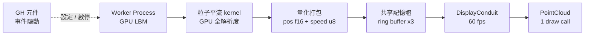
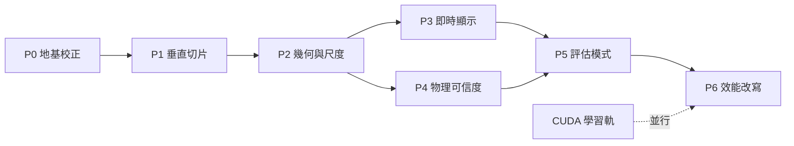

# GH-LBM 研發計畫書與任務進度表

> 版本日期：2026-09-22 ｜ 匯出自 Claude Docs（rev 42）

以 Grasshopper 為主介面、GPU Lattice-Boltzmann 為引擎的多尺度風環境模擬工具。七個階段從最小串接做到產品就緒，搭一條並行的 CUDA 學習軌。本文件是主計畫與可勾選的任務清單；技術實作、觀念背景與 CUDA 教學分在另三份。

## 定位與四份文件的分工

### 這一套文件怎麼用

| # | 文件 | 回答的問題 | 什麼時候看 |
| --- | --- | --- | --- |
| **01** | 研發計畫書與任務進度表（本件） | 做什麼、何時做、做到哪了 | 每週規劃與檢視 |
| **02** | @02 GH-LBM 全階段技術細節 | 具體怎麼做、會踩到什麼坑 | 動手實作某個任務時 |
| **03** | @03 GH-LBM 觀念與知識背景 | 為什麼這樣做、背後的理論 | 卡住時、寫論文時 |
| **04** | @04 GH-LBM CUDA Kernel 手寫教學 | 怎麼手寫 GPU kernel | 跑學習軌時（並行） |
| **05** | @05 GH-LBM 專案結構與 DevOps 準備 | 專案怎麼開、CI／測試怎麼搭 | 真的要開始寫 code 前 |
| **06** | `docs/06-architecture.md` | 原 repo 的程式架構與運行邏輯 | 要搬用或修改原始程式時 |

四份各自獨立，不互相依賴閱讀順序。本件的任務表會標註對應到 02 的哪一節。

### 現階段定位

交付對象是研究本人與內部團隊，不是公開發佈版本；但每一個架構決策都以「未來可直接轉產品」為約束。兩者的差別在**完成度**，不在**架構**。

| 面向 | 現階段 | 未來產品 | 需重寫？ |
| --- | --- | --- | --- |
| 使用者 | 本人 + 團隊 3–5 人 | 外部設計師 | 否 |
| 介面 | GH 元件，參數直接外露 | GH 元件 + Rhino command | 否，加一層 |
| 求解器部署 | 同機獨立行程 | 同機獨立行程 | 否 |
| 錯誤處理 | 印堆疊即可 | 使用者可理解的訊息 | 否，加一層 |
| 安裝 | 手動裝環境 | 打包安裝程式 | 否 |
| 驗證 | 自己對 benchmark | 公開驗證報告 | 否 |

### 四條設計原則

1. **垂直切片優先**。先用最醜的方式把整條鏈路串通（GH → 求解器 → 畫面），再回頭逐段深化。最大的風險不在任何單一技術，而在**銜接**。
2. **Grasshopper 為主介面**。不做 Rhino plugin-first。GH 元件可以被 Galapagos、Wallacei、Colibri 驅動，接得上參數化最佳化與批次研究。
3. **求解器與 Rhino 完全解耦**。不是為了效能，是為了崩潰隔離（taichi kernel 可能 hard crash 整個行程）與未來換後端時上層不動。
4. **雙模式從第一天分開**。設計模式（單風向、即時）與評估模式（多風向、批次）預算差 8–16 倍，資料流與 UI 也完全不同。

## 系統架構摘要

不卡頓的關鍵不在求解器快不快，而在**三個時鐘完全解耦**。



虛線是重點：**GH 不參與每幀**。用 GH Timer 以 30fps 驅動整張圖會讓 definition 每秒重算 30 次，是這類工具最常見的死法。

### 三個獨立的解析度

|  | 典型值 | 決定什麼 |
| --- | --- | --- |
| 模擬網格 N_sim | 2–30 M cells | 物理準確度、Δx |
| 回傳負載 N_vis | 50k 粒子 | IPC 頻寬、CPU 成本 |
| 螢幕像素 N_screen | 2K / 4K | Rhino 自己處理 |

關鍵設計：**粒子表示法，不是場降採樣**。以 8.4M cells 為例，全速度場（f32×3）是 **101 MB/frame**，分布函數場（f32×19）是 638 MB；粒子 payload 只有 **350 KB** 且**與 N_sim 完全無關**——差三個數量級。粒子平流在 GPU 上對全解析度場做 trilinear 插值，所以畫面保有完整細節。

換到 30M cells，全速度場變 360 MB，粒子仍然是 350 KB。這就是「與 N_sim 無關」的意思。

### 雙模式

|  | 設計模式 | 評估模式 |
| --- | --- | --- |
| 風向 | 1 | 8–16 |
| 目的 | 看流場、改造型 | 出舒適度圖、交報告 |
| 網格 | 8–20 M | 20–100 M |
| 視覺 | 即時粒子 | 靜態彩圖 + 分級 |
| 時間 | 秒級 | 15 分鐘到過夜 |

風向乘數是容易被漏掉的事實：**一張行人風舒適度圖是 8–16 個方向各自跑到收斂**，再用風玫瑰加權。「8M cells 夠用」這個結論只對設計模式成立。

> 架構的完整推導與實作細節見文件 **02**；為什麼這樣設計的理論背景見文件 **03**。

## 尺度與預算系統

LBM 求解器本身不知道物理尺度，kernel 裡沒有任何帶單位的變數。三個尺度**共用同一份 kernel、同一份記憶體配置、同一個格數**。

### 三尺度 @ 8.4M cells

|  | 都市 | 建築 | 室內 |
| --- | --- | --- | --- |
| 計算域 (m) | 1500×1000×300 | 300×200×120 | 20×15×4 |
| Δx | 3.77 m | 0.95 m | 5.2 cm |
| 網格 | 398×265×80 | 316×211×126 | 382×287×77 |
| 參考風速 | 5 m/s | 5 m/s | 0.3 m/s |
| Reynolds | 2×10⁷ | 7×10⁶ | 6×10⁴ |
| Δt | 0.038 s | 0.0095 s | 0.0087 s |
| 收斂步數 | ~24,000 | ~19,000 | ~76,000 |

Δx 跨 72 倍，計算域體積跨 375,000 倍。

> 📌 **這張表是全套文件的單一來源。** 02–06 只引用不重列。要改參數只改這裡，否則「讀 01 做事、讀 03 查理由」的人會拿到相反的指示。
>
> u_lat = 0.05 指的是**入流值**。建築轉角與缿縮流會讓局部峰值達 1.5–2.5 倍，所以實際要監控的是 `get_max_v() / 0.577`，超過 0.25 就降 u_lat 重跑。

### 可解析特徵與輸出限制

| 特徵 | 都市 | 建築 | 室內 |
| --- | --- | --- | --- |
| 建築量體 20m | 5.3 格 | 21 格 | — |
| 街道寬 15m | 4 格 | 16 格 | — |
| 開口／窗 1m | ✗ | 1 格 | 19 格 |
| 人體 0.4m | ✗ | ✗ | 7.7 格 |
| 行人高度 z=1.5m | **0 格** | 1.6 格 | — |

**硬限制：都市尺度下 z = 1.5 m 落在第一層格心（1.9 m）以下，行人風輸出必須在 UI 鎖掉**，直到 P4 的地表 wall function 做完。

### 自動解析度推導：反過來算

Δx 的有效區間是由「要解析什麼特徵」決定的，不是由算力預算決定的。

```
舊：N_budget 固定 → Δx = (V/N)^⅓ → 使用者看著 Δx 變化猜品質
新：分析類型 → Δx 固定 → N = V/Δx³
    → 告訴使用者「需 33M cells / 5.6 GB / 16 風向約 2.5 小時」
```

| 尺度 | 上游 | 下游 | 側向 | 頂部 |
| --- | --- | --- | --- | --- |
| 都市／建築（務實） | 3H | 8H | 3H | 4H |
| 都市／建築（嚴格） | 5H | 15H | 5H | 6H |
| 室內 | 不擴張，房間本體 + 開口外 1–2 m |  |  |  |

務實版體積只有嚴格版的 29%，而收斂步數 ∝ 流向格數，所以**縮小計算域是免費的解析度提升**。

### 四次方縮放律

```latex
t_{\text{converge}} \;\propto\; \frac{(L/\Delta x)^4}{\text{MLUPS}}
```

Δx 減半 → 收斂時間 ×16。後端加速 4 倍，相同等待時間下只換到 Δx 細 1.4 倍——這是效能優化排在 P6 而不是 P1 的原因。

## 七階段總覽與時程

時程假設**每週 15–20 小時**的研究節奏；全職投入約可減半。

| 階段 | 目標 | 主要交付 | 週數 | 累計 |
| --- | --- | --- | --- | --- |
| **P0** 地基校正 | 確認求解器是對的 | 可信 solver + 驗證套件 | 1–2 | 2 |
| **P1** 最小垂直切片 | 端到端串通 | GH 按一下看到粒子流動 | 2–3 | 5 |
| **P2** 幾何與尺度 | 吃進真實幾何 | 體素化 + 三尺度 + 品質閘 | 3–4 | 9 |
| **P3** 即時顯示層 | 拖動建築不卡 | 60 fps conduit + 獨立行程 | 3–4 | 13 |
| **P4** 物理可信度 | 可以寫進論文 | LES + ABL + wall fn + benchmark | 4–6 | 19 |
| **P5** 評估模式 | 出舒適度圖 | 多風向 + Lawson + 氣象資料 | 3–4 | 23 |
| **P6** 效能改寫 | 2–3× 吞吐 + 4× 格數容量 | in-place + FP16 + 手寫 CUDA | 4–8 | 31 |

**總計約 5–8 個月。** 每個階段結束都有可用的東西：

| 這裡停下來 | 你手上會有 |
| --- | --- |
| P1 | 技術路線獲證，最大風險消除 |
| P3 | 自己做設計研究已經夠用 |
| P4 | 可以發表 |
| P5 | 團隊可以拿去做真案子 |
| P6 | 具備轉產品的效能條件 |

### 依賴關係



P3 與 P4 可以並行（一個是顯示、一個是物理，互不干擾）。其他是硬依賴。

### 提早觸發條件

P6 的記憶體優化排在最後，但如果 **P4 的 benchmark 驗證單次跑超過 20 分鐘**，就把 P6 的 FP16 部分提前插入 P4 之前。否則你會在慢引擎上做物理驗證，浪費的時間比優化本身還多。

反之，P6 的**手寫 CUDA 永遠不該提前**——它是學習目標，不是效能瓶頸的解方（in-place + FP16 才是）。

## P0–P1 任務進度表

### P0 地基校正（1–2 週）

目標：確認手上的求解器是對的。完全在 Python 命令列完成，不碰 Rhino。

**P0.1 tau_f 公式驗證**（半天 · 02 文件 P0.1）

- [ ] **先寫衰減剪切波測試**（無外力、週期邊界，約 50 行）
- [ ] 量測衰減率反推 ν，與 `niu` 比對：比值是 **1** 還是 **1/9**
- [ ] 修正 `tau_f = 3.0*self.niu + 0.5`（第 127 行）
- [ ] 修正 Guo 外力項（第 236 行）：`/3.0` → `*3.0`、`/9.0` → `*9.0`
- [ ] 重跑 Poiseuille：只改一處會先壞（差 9 倍），兩處都改才回到正確值
- [ ] 確認 Cavity Re=100 對 Ghia 誤差 < 3%

> ⚠️ **不要只用 Poiseuille 驗證。** `commit a0461be` 同時改了 `tau_f` 與 Guo 外力係數，兩個錯誤在外力驅動流裡精確抵消（F/9 配 ν/9），所以 Poiseuille 會**假性通過**。完整推導見 02 文件 P0.1。

**P0.2 ghost mode 鬆弛率解耦**（1 天 · 02 文件 P0.2）

- [ ] 確認 `S_dig` 實際配置：`s_other` **只在 index 4, 6, 8, 16, 17, 18**（奇矩 q、m），其餘非守恆矩全是 `s_v`
- [ ] 驗算 Λ = (1/s⁺ − ½)(1/s⁻ − ½) = **3/16 恆定**（跨 τ = 1.0 / 0.8 / 0.6 / 0.51 / 0.5003）
- [ ] **把 M 換成正交 d'Humières 基底並重算 meq**
- [ ] 換基底後用相同有效鬆弛率跑一次，確認與現行版**逐格一致**（差異在浮點誤差級）
- [ ] 確認三對被綁在一起的矩（1,2）、（9,10）、（11,12）已解開
- [ ] 多孔介質模式保留 Λ = 3/16 為可切換選項

> ⚠️ **不要把 `s_other` 設成常數 1.0。** 那會讓 Λ 隨 τ 漂移 → 壁面位置隨黏度變動，P4 的 LES（τ 逐格變）與 P5 的多風向掃描會全部受影響。這是 repo 目前**做對**的設計，不要弄壞。完整說明見 02 文件 P0.2。

**P0.3 幾何注入**（半天 · 02 文件 P0.3）

- [ ] 加 `init_geo_from_array(arr)`
- [ ] 用**不對稱**盒子（x 10 格、y 20 格）驗證 `order='F'` 維度順序

**P0.4 驗證套件**（3–4 天 · 02 文件 P0.4）

- [ ] Poiseuille 自動化比對（誤差 < 1%）
- [ ] Cavity Re=100 對 Ghia et al. 1982（< 3%）
- [ ] Cavity Re=400（< 5%）
- [ ] Cavity Re=1000（< 8%）
- [ ] 包成一個 `run_all` 腳本，每次改 kernel 都跑

**P0.5 單位換算模組**（1–2 天 · 02 文件 P0.4）

- [ ] `units.py` 雙向換算函式
- [ ] 三個警告條件：Ma > 0.2、τ < 0.501、τ > 1.5
- [ ] 單元測試（已知答案的幾組參數）

### P1 最小垂直切片（2–3 週）

目標：消除最大技術未知。醜、慢、會卡都可以。

**P1.1 環境測試**（30 分鐘，**最優先** · 02 文件 P1.1）

- [ ] Rhino 8 Python 元件裡 `import taichi`
- [ ] `ti.init(arch=ti.gpu)` 確認實際 backend（有沒有退回 CPU）
- [ ] 記錄三個數字：`ti.init()` 耗時、首次 JIT、第二次呼叫
- [ ] 判定 A／B／C 路線並記錄決定

**P1.2 求解器驅動**（2–3 天 · 02 文件 P1.2）

- [ ] 加 `velocity_numpy()` 取代 `export_VTK()`
- [ ] 寫死 64³ 盒子幾何（**不接 Rhino 幾何輸入**）
- [ ] 確認所有 `set_*` 都在 `init_simulation()` 之前

**P1.3 資料契約**（1 天，**唯一要認真做的設計** · 02 文件 P1.3）

- [ ] 定義 `PARTICLE_DTYPE`（pos f16×3 + speed u8 + flags u8 = 8 bytes）
- [ ] 座標正規化到 [0,1]（**不存公尺**）
- [ ] 標頭：version / n_particles / frame_id / speed_max / bbox

**P1.4 GH 元件**（3–4 天 · 02 文件 P1.4）

- [ ] 單一元件 I/O（Run / Reset / Steps / NumParticles → Points / Speeds / MaxV / Info）
- [ ] `scriptcontext.sticky` + InstanceGuid 狀態保存
- [ ] Reset 重用 field 不重配（連按 20 次 VRAM 不漲）
- [ ] 複製一份元件，確認兩組參數互不干擾

**P1.5 粒子平流**（2–3 天 · 02 文件 P1.5）

- [ ] numpy 向量化 trilinear 插值（**不寫 Python 迴圈**）
- [ ] 三個重生條件：出域、進 solid、連續 k 步低速
- [ ] 入流面隨機播種
- [ ] 粒子 dt 做成獨立顯示參數（**不等於 LBM 的 Δt**）

**P1.6 顯示與驗收**（2 天 · 02 文件 P1.6）

- [ ] `Point3d` 輸出 + Gradient + Custom Preview 上色
- [ ] 記錄 1000 / 5000 / 20000 粒子的 GH 幀率（P3 的基準線）
- [ ] 走完 02 文件 P1.6 的完整驗收清單

## P2–P3 任務進度表

### P2 幾何與尺度系統（3–4 週）

**P2.1 體素化**（1–1.5 週，**本階段最大工程量** · 02 文件 P2.1）

- [ ] Z 方向 ray-stabbing parity test（`Intersection.MeshLine` 取排序交點配對填充）
- [ ] 封閉性檢測，決定走哪條路徑並告知使用者
- [ ] 破面 fallback：三角形光柵化出表面體素（加厚 1 格）+ 從外部 flood fill
- [ ] 效能目標：8M cells 體素化 < 5 秒
- [ ] 用真實建築師模型（不是自己做的乾淨模型）測試

**P2.2 尺度系統**（5–7 天 · 02 文件 P2.2）

- [ ] 三尺度預設與各自的計算域擴張規則
- [ ] 自動 Δx 推導（分析類型 → Δx → N → 記憶體與時間估計）
- [ ] Δx 量化到 0.02 / 0.05 / 0.1 / 0.25 / 0.5 / 1 / 2 / 5 m
- [ ] 品質閘：都市≥4 格街道、建築≥10 格量體、室內≥5 格開口
- [ ] **無效輸出鎖定**：Δx > 2 m 時鎖掉行人風輸出並說明原因

**P2.3 邊界條件**（3–4 天 · 02 文件 P2.3）

- [ ] ABL 入流剖面（逐格向量場，power law α = 0.14～0.33 可調）
- [ ] 地表粗糙度 z₀ 參數化

**P2.4 GH 元件拆分**（3–4 天 · 02 文件 P2.4）

- [ ] `WindDomain`：幾何 + 分析類型 + 預算 → domain 規格 + 品質報告
- [ ] `WindSolve`：domain + 風速風向 → solver handle
- [ ] `WindResult`：handle → 速度場、粒子、切面
- [ ] 參數 JSON schema（未來 UI 自動生成、批次與最佳化套用）
- [ ] 快取 key 設計：幾何 hash + 參數 hash（P5 才用到，**現在決定**）

### P3 即時顯示層（3–4 週）

這是效能第一次成為主題的階段，但針對的是**顯示效能**，不是求解器效能。

**P3.1 GPU 粒子平流 kernel**（3–4 天 · 02 文件 P3.1）

- [ ] taichi kernel 對全解析度場做 trilinear 插值
- [ ] 三個重生條件移到 GPU 端
- [ ] 與 P1 的 CPU 版逐粒子比對驗證

**P3.2 量化打包**（1 天）

- [ ] pos → f16、speed → u8，套用 P1.3 定好的 dtype
- [ ] 確認 50k 粒子 = 350 KB/frame

**P3.3 獨立行程 + 共享記憶體**（5–7 天 · 02 文件 P3.2）

- [ ] worker process 啟停與生命週期管理
- [ ] ring buffer ×3 + atomic write index（**無鎖**，producer 不被拖慢）
- [ ] watchdog：parent PID 消失就自殺
- [ ] GH document 關閉時確實 kill worker

**P3.4 C# DisplayConduit**（5–7 天 · 02 文件 P3.3）

- [ ] 一個 `PointCloud`（帶 per-point color），**一次 draw call**
- [ ] 獨立於 GH solve 的 60 fps 重繪
- [ ] 幾何建立回到 UI thread（`RhinoApp.InvokeOnUiThread`）

**P3.5 時間插值與自動降級**（3–4 天 · 02 文件 P3.4）

- [ ] CPU 端次步平流（模擬 5 步/s 也要 60 fps）
- [ ] 幀率 < 30 自動減粒子、> 55 自動加
- [ ] 總延遲量測（目標 < 100 ms）

**P3.6 健壯性**（2–3 天 · 02 文件 P3.5）

- [ ] JIT 預熱 + `offline_cache=True` + 「編譯中」狀態
- [ ] 發散偵測：max |u_lattice| > 0.3 自動降 Δt 並告知
- [ ] **熱啟動**：改幾何不重置 f 場，只更新 solid 標記

## P4–P6 任務進度表

### P4 物理可信度（4–6 週）

從「看起來像風」到「是風」的階段。

**P4.1 LES 湍流模型**（1.5–2 週 · 02 文件 P4.1）

- [ ] 從非平衡矩 `m_temp - meq` 取得應變率張量（**不用有限差分、不用額外記憶體**）
- [ ] **先做 Smagorinsky**（只需 S_ij，從 f^neq 直接拿，C_s ≈ 0.1）
- [ ] 只改 index **9, 11, 13, 14, 15**（剪應力矩）
- [ ] 確認 index 1（bulk）與奇矩（4,6,8,16,17,18）**沒被動到**
- [ ] `S_dig` 從 `shape=()` 全域向量改成 kernel 內逐格計算
- [ ] 係數換算對一次 Hou et al. 1996 或 Krafczyk et al. 2003（**不憑記憶寫**），並用 Taylor–Green 驗證衰減率
- [ ] 量測近壁行為，再決定要不要加 Van Driest damping

> ⚠️ **WALE 做不到「不用有限差分」。** f^neq 的二階矩只給出**對稱**的 S_ij；WALE 需要完整速度梯度（含渦度），必須做有限差分，約 +30–50% 頻寬，而且會把 P6.0 的 kernel 融合變難。先 Smagorinsky，不夠再談。

**P4.2 邊界條件補完**（1–1.5 週 · 02 文件 P4.2）

- [ ] convective outflow BC（取代固定壓力，消除反射）
- [ ] **地表 wall function**（對數律外推到 z = 1.5 m）——解鎖都市尺度行人風的唯一途徑
- [ ] 解鎖後移除 P2.2 的行人風輸出鎖定

**P4.3 u_lat 提升**（1 天）

- [ ] **入流 u_lat 維持 0.05，不要提到 0.10**
- [ ] 監控的是**局部峰值**：`get_max_v() / 0.577` = 實際 Ma，超過 0.25 就降 u_lat 重跑
- [ ] 需要餘裕時降到 0.03–0.04，而不是往上推

> ⚠️ 我之前寫「提到 0.10，步數減半」是**錯的**，漏掉了局部加速。轉角與缿縮流會讓局部速度達入流的 1.5–2.5 倍：入流 0.10 → 峰值 0.15–0.25 → Ma 0.26–0.43，極易發散。入流 0.05 就已經在上限。**收斂步數維持建築 ~19,000、都市 ~24,000**，P5 的時間估算以這組為準。

**P4.4 驗證**（1.5–2 週 · 02 文件 P4.4）

- [ ] 單建築立方體繞流對 CEDVAL 或 AIJ 標準案例
- [ ] 街谷 (street canyon) 案例
- [ ] 網格獨立性測試：同一案例跨三個 Δx
- [ ] 寫成驗證報告（可直接當論文的驗證章節）

### P5 評估模式與氣象校正（3–4 週）

**P5.1 多風向批次**（5–7 天 · 02 文件 P5.1）

- [ ] 佇列、進度回報、可中斷可續跑
- [ ] 結果快取（套用 P2.4 的 hash key）——改一個風向不重跑全部

**P5.2 舒適度評估**（5–7 天 · 02 文件 P5.2）

- [ ] 風玫瑰加權合成
- [ ] Lawson 準則（預設）
- [ ] NEN 8100 準則（超越機率閾值不同，分開實作）
- [ ] 分級彩圖 mesh + CSV 輸出，可接回 GH

**P5.3 氣象資料與校正**（5–7 天 · 02 文件 P5.3）

- [ ] EPW 讀取（標準格式，直接拿風玫瑰）
- [ ] 中央氣象署測站資料讀取與格式轉換
- [ ] 兩段式地況轉換模組（Wieringa）：測站 z₀ → 梯度風高度 → 基地 z₀
- [ ] **資料來源抽象層**：EPW、測站、手動輸入走同一介面

### P6 效能與記憶體優化（4–8 週）

順序不能換：**先融合 kernel**，再調佈局與精度。手寫 CUDA 是學習目標，不是效能解方。

**P6.0 kernel 融合**（1–2 週，**最大的單一收益** · 02 文件 P6.0）

- [ ] 確認 repo 現況的流量：`colission` 42 + `streaming1` 38 + `streaming3` 42 = **122 floats = 488 B/cell/step**
- [ ] 把 collision 與 streaming 融成一個 kernel（讀鄰居 f 進寄存器 → 算巨觀量 → 碰撞 → 直接寫出）
- [ ] `Boundary_condition()` 改成只處理邊界層，或整合進融合 kernel
- [ ] rho 與 v 只當寄存器中間值，除非要輸出否則不落記憶體
- [ ] 量測：目標 488 B → **152 B（3.2×）**
- [ ] 每一步跨 P0 驗證套件確認結果不變

> ⚠️ 我原本把 152 B 寫成「現行」，那其實是**理想融合實作**的數字。repo 實際是 488 B（三次全陣列往返），所以 README 的 900 MLUPS 在 A100-40GB 上是 **28% 頻寬利用率**，不是 9%。先融合，否則 SoA 與 FP16 的收益會被全陣列往返淹掉。

**P6.1 SoA 佈局**（3–5 天 · 02 文件「SoA 佈局」節）——改 coalescing 效率，不改 bytes/cell/step，需實測

- [ ] 先用 `kernel_profiler=True` 量出融合後的實測 MLUPS 與 achieved bandwidth
- [ ] 確認 `ti.Vector.field(19, ...)` 的實際佈局（**實測，不要假設**）
- [ ] 改成 SoA（`layout=ti.Layout.SOA` 或 19 個獨立 scalar field）
- [ ] 重測並比對——這就是 CUDA 學習軌 L3 的實驗題目

**P6.2 In-place streaming**（2–3 週 · 02 文件「In-place streaming」節）

- [ ] AA-pattern（奇偶步不同讀寫模式，最簡單）
- [ ] 每步跨 P0 驗證套件確認結果不變
- [ ] 量測**記憶體佔用**：152 → 76 bytes/cell（流量不變，仍是 19 讀 + 19 寫）
- [ ] 量測實際 MLUPS：主要收益來自避開 write-allocate 與 L2 重用，**不要在量測前假設 2×**
- [ ] （選）Esoteric Pull：單陣列 + 隱式 bounce-back

**P6.3 FP16 儲存 / FP32 計算**（1–2 週 · 02 文件「FP16 儲存」節）

- [ ] `ti.f16` 儲存分佈函數，碰撞仍用 f32
- [ ] 拿 P0 benchmark 套件跑精度驗證（**自己確認，不要假設可忽略**）
- [ ] 量測**流量**：152 → 76 bytes/cell/step——這才是真正的 2× 頻寬槓桿
- [ ] 搭配 in-place 後佔用降到 38 bytes/cell，同顯存能跑 4 倍格數

**P6.3 手寫 CUDA**（見 CUDA 學習軌 · 04 文件）

**P6.4 benchmark 對照**（3–5 天 · 02 文件 P6.4）

- [ ] taichi 版當 ground truth，每一步優化都要能重現相同結果
- [ ] 測出實際 MLUPS 並與理論頻寬上限比對
- [ ] 決定三種結局哪一種（換掉／留 taichi／只換最熱 kernel）

## CUDA 學習軌進度表

**不要等到 P6 才開始。** 這條軌從 P1 就並行，理由有三：不用等；taichi 版可以當 ground truth 逐步驗證；風險隔離（CUDA 版沒寫好不影響主線）。

起點是現有的 **taichi D2Q9** ——有一個自己寫的、知道正確答案的小程式可以移植，比從教學範例學有效得多。

| 里程碑 | 內容 | 對應主線 | 週數 | 驗證方式 |
| --- | --- | --- | --- | --- |
| **L1** | CUDA 基礎：grid/block/thread、記憶體層次、vector add | P1 | 跟 CPU 版對答案 |  |
| **L2** | **D2Q9 手寫 CUDA** — 從 taichi 版逐行移植 | P1–P2 | 跟 taichi 版逐格比對 |  |
| **L3** | coalescing：AoS vs SoA 實測 | P2 | 同 kernel 兩佈局測 MLUPS |  |
| **L4** | D2Q9 in-place streaming（AA-pattern） | P3 | 結果不變、記憶體減半 |  |
| **L5** | **D3Q19 手寫 CUDA** + MRT 碰撞 | P4 | 對 P0 benchmark 套件 |  |
| **L6** | FP16 + Esoteric Pull | P5–P6 | 精度與效能雙測 |  |
| **L7** | 與 taichi 版完整 benchmark 對照 | P6 | 決定要不要真的換掉 |  |

### 任務清單

- [ ] **L1**（約 1 週）grid/block/thread 索引、warp、記憶體層次、kernel launch、錯誤檢查、從 Python 呼叫（CuPy RawKernel 或 PyCUDA）
- [ ] **L2**（約 2 週）D2Q9 資料佈局、一 thread 一 cell、邊界處理、與 taichi 版逐格比對定容差
- [ ] **L3**（約 1 週）設計乾淨的 AoS vs SoA 實驗，測出 MLUPS 差距，從頻寬反推理論上限
- [ ] **L4**（約 1.5 週）AA-pattern 奇偶步讀寫模式、驗證結果不變、量測記憶體減半
- [ ] **L5**（約 3 週）D3Q19 速度集、MRT 矩陣乘法要不要展開、暫存器壓力與 occupancy 取捨
- [ ] **L6**（約 2 週）`__half` / `__half2`、儲存 FP16 計算 FP32、Esoteric Pull 概念
- [ ] **L7**（約 1 週）benchmark 方法論、Nsight Compute 關鍵指標、判讀是否接近頻寬上限

### 把 taichi 當成 CUDA 的教學工具

- [ ] 翻開 `example_cavity.py` 裡的 `print_ir=True`，看產生的 IR
- [ ] 翻開 `kernel_profiler=True`，取得逐 kernel 計時
- [ ] 先用 taichi 寫出正確版本 → 看它產生了什麼 → 再手寫

### 終點是開放的

L7 跑完之後，三個結果都合理：

| 結果 | 作法 |
| --- | --- |
| CUDA 版贏很多 | 後端換成 C++/CUDA |
| 差距不大 | 留著 taichi，CUDA 經驗當知識資產 |
| 更快但難維護 | 只把最熱的 collision-streaming kernel 換掉 |

**三個都不是失敗。** 這條軌的目的是讓你有能力做這個判斷，而不是預設答案。

> 完整教學內容見文件 **04**。

## 里程碑驗收標準與風險登記

### 驗收標準

每個階段的「做完了」要有可驗證的定義，否則永遠在 90%。

| 階段 | 通過條件（全部滿足才算） |
| --- | --- |
| **P0** | 衰減剪切波測出 ν/niu = 1；Cavity Re=100 對 Ghia < 3%；M 換成正交基底且與舊版逐格一致；`run_all` 一鍵可跑 |
| **P1** | GH 按一下出現流動粒子；不對稱盒子方向正確；連按 20 次 Reset 不漲 VRAM |
| **P2** | 真實建築師模型（含破面）能跑；三尺度切換正確；品質閘會擋下無效輸出 |
| **P3** | 拖動建築延遲 < 100 ms；畫面穩定 60 fps；worker 崩潰不帶走 Rhino |
| **P4** | Smagorinsky 對 Taylor–Green 驗證通過；至少一個標準 benchmark 符合；行人風鎖定解除 |
| **P5** | 16 風向舒適度圖產出；EPW 與測站兩種來源都跑得通 |
| **P6** | **流量 488 → 152 B/cell/step（融合）→ 76 B（FP16）**；佔用降到 38 B/cell；P0 驗證套件全過 |

### 現在就要做對的七個決策

這些現在做幾乎不花成本，以後改則要重寫。

1. **求解器與 Rhino 完全解耦**——研究期就用獨立行程
2. **單位換算是獨立模組**——永遠不讓物理單位漏進 kernel
3. **GH 元件保持薄**——只做 I/O 與參數驗證，沒有演算邏輯
4. **顯示 payload 格式凍結**——粒子座標 + 速度，寫成規格文件
5. **參數用 schema 定義**——未來 UI 自動生成、批次與最佳化套用
6. **資料來源抽象**——EPW、測站、手動輸入走同一介面
7. **快取 key 設計**——幾何 hash + 參數 hash，P2 就要決定

### 風險登記

| 風險 | 階段 | 機率 | 衝擊 | 應對 |
| --- | --- | --- | --- | --- |
| **repo 的 ν 實際小 9 倍，且被外力錯誤掩蓋** | P0 | **已確認** | 高 | 用衰減剪切波而非 Poiseuille 驗證；兩處都要修 |
| **taichi 上游維護狀態** | 全程 | 中 | 高 | 1.7.x 之後釋出較慢；`ti.f16` 於 CUDA 的成熟度需實測。CUDA 學習軌就是這個風險的避險 |
| taichi 在 Rhino 8 Python 跑不起來 | P1 | 中 | 高 | subprocess 備案；本來就是最終方向 |
| 體素化對破面容忍不足 | P2 | 高 | 中 | 雙路徑 + 封閉性檢測 |
| GH 每幀 re-solve 拖垮畫面 | P3 | 中 | 高 | conduit 完全繞開 dataflow |
| LES 調不到穩定點 | P4 | 中 | 高 | 先換正交 M；Smagorinsky 而非 WALE |
| 評估模式時間不可接受 | P5 | 中 | 中 | 快取 + 降解析度預設 + 過夜批次 |
| kernel 融合引入難找的 bug | P6 | 高 | 中 | P0 驗證套件每次都跑 |
| 範圍蔓延 | 全程 | 高 | 高 | 每階段都有明確的「不做什麼」 |
| **四份文件數字不一致** | 全程 | 中 | 高 | 參數以本件為單一來源，其他五份只引用 |

最後一項是真正的殺手。文件 **02** 裡每個階段都寫了刻意不做的事，那些不是疏漏，是邊界。

### 第一週具體動作

1. 跑 `example_poiseuille_flow.py` 對解析解，確認 `tau_f` 公式——30 分鐘，但它決定後面所有數字可不可信
2. 在 Rhino 8 Python 元件裡試 `import taichi` 加 `ti.init(arch=ti.gpu)`——30 分鐘，但它決定整個架構走哪條路

不到一個下午，卻能消除整份計畫最大的兩個不確定性。
