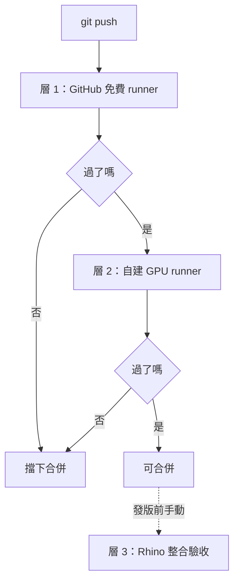

# GH-LBM 專案結構與 DevOps 準備

> 版本日期：2026-09-22 ｜ 匯出自 Claude Docs（rev 15）

真的要開始寫 code 之前要先搭好的東西：資料夾結構、環境管理、測試策略、CI/CD、大檔案處理。這些現在花一天做對，後面省一個月；現在不做，到 P4 會發現自己改了三十次 kernel 卻不知道哪一次開始算錯。

## 先看清楚：這個專案對 CI 很不友善

一般的 Python 專案，GitHub Actions 免費 runner 就能跑完所有測試。這個專案不行，因為它同時有三個麻煩的特性：

| 特性 | 影響 | 免費 runner 能跑嗎 |
| --- | --- | --- |
| **需要 NVIDIA GPU** | taichi CUDA backend、效能 benchmark | ❌ |
| **需要 Rhino 8 + 授權** | GH 元件、體素化、DisplayConduit | ❌ |
| **產出大二進位檔** | 體素陣列、速度場、VTK | ⚠️ 不適合進 git |

這三件事決定了後面所有設計。**不要想把全部測試都塞進 CI**，那會失敗很多次然後你就把 CI 關掉了。正確做法是**分層**：能在免費 runner 跑的自動跑，需要 GPU 的放自建 runner，需要 Rhino 的老實承認只能手動。

### 這直接導出一個架構規則

> **`core/` 裡的任何檔案都不得 import Rhino 相關的東西。**

這不是潔癖，是三個實際收益：

1. **CI 跑得起來**。求解器、單位換算、舒適度準則、氣象資料處理都能在 Linux 免費 runner 上測。
2. **未來換前端不痛**。今天是 GH，明天可能是 Rhino command、命令列批次、甚至 web。核心不動。
3. **測試不需要開 Rhino**。這是日常開發速度的關鍵——每改一行就要重開 Rhino 驗證的話，一天做不了幾件事。

它也呼應了計畫書（@01 GH-LBM 研發計畫書與任務進度表）的第三條設計原則「求解器與 Rhino 完全解耦」——那條原則原本是為了**崩潰隔離**，現在又多了**可測試性**這個理由。兩個理由指向同一個設計，那通常代表這個設計是對的。

### 還有一個不一樣的地方：測試的本質

一般軟體的測試是「輸入 A 應該得到 B」。數值模擬沒這種東西：

- 浮點運算在 CPU 與 GPU 上結果不會位元相同（結合律不成立、FMA、平行累加順序）
- 換一張顯卡、換一個 taichi 版本，數字就會變
- 但「變一點點」跟「演算法改錯了」在數字上可能很像

所以測試必須是**容差式的黃金值比對**，而且容差要有物理依據而不是拍腦袋。這件事在 s4 展開。

## Repo 策略與資料夾結構

### 一個 repo 還是多個？

**一個。** 這個專案有 Python（求解器）、C#（GH 元件）、文件三種東西，看起來像要拆，但在這個階段拆開是錯的：

- 資料契約（粒子 payload 格式）橫跨兩邊，拆開後每改一次要同步兩個 repo 的版本
- 一個人開發，多 repo 的好處（獨立發佈、獨立權限）一個都用不到
- 跨語言的改動（改 payload 格式）在單一 repo 裡是一個 commit，拆開後是兩個 PR 加一場協調

### 完整結構

```
gh-lbm/
├─ .github/
│  └─ workflows/
│     ├─ ci-cpu.yml          # 免費 runner：lint + 單元 + CPU 回歸
│     ├─ ci-gpu.yml          # 自建 runner：GPU 回歸 + benchmark
│     └─ docs.yml            # 文件建置
│
├─ docs/                    # 01–06 這套文件的 markdown 副本
│  ├─ 01-plan.md
│  ├─ 02-technical.md
│  ├─ 03-concepts.md
│  ├─ 04-cuda.md
│  ├─ 05-devops.md
│  └─ 06-architecture.md   # 原 repo 的架構解析
│
├─ src/
│  ├─ ghlbm/                        # 純 Python 套件（pip install -e .）
│  │  ├─ core/                      # ★ 絕不 import Rhino
│  │  │  ├─ solver.py               # LBM 主體
│  │  │  ├─ collision.py            # MRT / LES
│  │  │  ├─ boundary.py             # ABL / outflow / wall function
│  │  │  ├─ particles.py            # GPU 粒子平流
│  │  │  ├─ units.py                # 物理↔lattice 換算
│  │  │  └─ diagnostics.py          # 發散偵測、收斂判定
│  │  ├─ geometry/                  # 體素化（純 numpy，不依賴 Rhino）
│  │  │  ├─ voxelize.py
│  │  │  └─ watertight.py           # 封閉性檢測
│  │  ├─ scales/                    # 三尺度預設、自動 Δx、品質閘
│  │  ├─ meteo/                     # EPW / 測站 / 地況轉換
│  │  ├─ comfort/                   # Lawson / NEN 8100
│  │  ├─ ipc/                       # payload 規格 + ring buffer
│  │  │  └─ payload.py              # ★ 資料契約的唯一真相
│  │  └─ worker/                    # 獨立進程進入點
│  │     └─ __main__.py
│  │
│  └─ GhLbm.Gh/                     # C# GH plugin
│     ├─ Components/                # WindDomain / WindSolve / WindResult
│     ├─ Display/                   # DisplayConduit + PointCloud
│     ├─ Ipc/                       # 共享記憶體讀取端
│     └─ GhLbm.Gh.csproj
│
├─ tests/
│  ├─ unit/                         # 純邏輯，毫秒級
│  ├─ regression/                   # 數值回歸
│  │  ├─ test_poiseuille.py
│  │  ├─ test_cavity.py
│  │  └─ golden/                    # 黃金值（小檔，進 git）
│  └─ bench/                        # 效能，只在 GPU runner 跑
│
├─ data/
│  ├─ geometry/                     # 測試幾何（小，進 git）
│  └─ reference/                    # Ghia et al. 1982 等參考值
│
├─ scripts/                         # 一次性工具、轉檔、畫圖
├─ runs/                            # ★ .gitignore，模擬輸出都在這
├─ pyproject.toml
├─ .gitignore
├─ CLAUDE.md                        # 給 AI 助手的專案說明
└─ README.md
```

### 幾個設計決定的理由

**`core/` 與 `geometry/` 分開**。體素化的輸入是三角網格、輸出是 numpy 布林陣列——它不需要知道 LBM，LBM 也不需要知道它從哪來。分開之後你可以用合成幾何測 LBM、用小網格測體素化，兩邊互不干擾。

**`ipc/payload.py` 是單一真相**。粒子資料的 dtype 只寫在這一個檔，Python 端與 C# 端都以它為準。C# 那邊的 struct 定義要加一個測試確認 `sizeof` 跟 Python 端一致——這種不一致在執行時會變成完全難懂的亂碼。

**`runs/` 進 `.gitignore`**。模擬輸出一定會變大，而且一定會有人不小心 `git add .`。現在就寫進去，不要等出事。

**`CLAUDE.md`**。既然你會用 AI 助手寫這個專案，把「這個 repo 的規則」寫成檔比每次重講一遍便宜。至少要寫：`core/` 不得 import Rhino、改 kernel 必須跑回歸測試、lattice 單位跟物理單位不得混用。

## 環境管理

### 兩個 Python 環境，不是一個

這是很容易搞混的地方。拆成獨立行程之後，你有兩個完全獨立的 Python：

|  | Rhino 內的 Python | Worker 行程的 Python |
| --- | --- | --- |
| 版本 | Rhino 8 內建 CPython 3.9（你改不了） | 你自己選，建議 3.11 或 3.12 |
| 裝什麼 | 幾乎什麼都不用 | taichi、numpy、全部依賴 |
| 職責 | 啟動 worker、傳參數 | 跑模擬 |
| 依賴管理 | 沒有（或只有標準庫） | `pyproject.toml` + lock |

**將 Rhino 內的 Python 保持在「只呢喬 subprocess」的程度**。不要在那邊裝 taichi（除非 P1 的環境測試走 A 路線，而那也只是過渡）。這樣你就不被 Rhino 的 3.9 綁住，可以用新版 Python 的東西。

### 依賴鎖定

`pyproject.toml` 定義依賴範圍，**一定要搭一個 lock 檔**（uv 、PDM 或 Poetry 都行，任選一個別混用）。

**taichi 的版本要釘死到 patch 版號**，不要用 `>=`：

```toml
dependencies = [
  "taichi==1.7.2",   # 釘死，不是 >=
  "numpy>=1.24,<2.0",
]
```

理由：taichi 的 kernel 編譯行為、預設記憶體佈局、`ti.f16` 的支援程度都可能隨版本變。**你的黃金值是綁定在特定版本上的**——自動升版會讓回歸測試莫名其妙地紅掉，而你會花半天找自己的 bug。

升 taichi 版本要當成**一個獨立的 commit**：只改版本號，跑全部回歸測試，把數值差異記錄在 commit message 裡。

### GPU 驅動與 CUDA

taichi 的 CUDA backend **只需要 NVIDIA 驅動程式**，不需要安裝完整的 CUDA toolkit（它用 driver API）。這降低了分發門檻很多。

但如果你走 CUDA 學習軌（文件 04）要手寫 kernel，**那就需要完整 toolkit**（nvcc）。兩者分開：主線只要驅動，學習軌要 toolkit。

### 環境可重現性

每次跑回歸測試，把這些記進輸出：

- taichi 版本、backend（cuda / cpu / vulkan）
- GPU 型號與驅動版本
- Python 版本、numpy 版本
- commit hash

不記的話，六個月後你看到一個奇怪的數字會完全無法判斷那是物理還是環境。這從 P0 的第一個 benchmark 就要開始做。

### Mac 的狀況

要誠實面對：

| 項目 | Mac / Apple Silicon |
| --- | --- |
| Rhino 8 | 有，但 GH Python 3 與 .gha 的行為與 Windows 有差異 |
| taichi CUDA | ❌ 沒有 |
| taichi Metal | 有，但效能與功能覆蓋較弱 |
| `ti.root.pointer` 稀疏結構 | ❌ Metal 不支援 |

建議：**主開發環境用 Windows + NVIDIA**。Mac 當成「未來可能要支援」而不是「現在要支援」，並且把這個決定寫進 README——否則團隊裡第一個用 Mac 的人會花一天追一個沒有答案的問題。

## 測試策略

### 這個專案的測試金字塔是倒的

一般軟體：大量單元測試 + 少量整合測試。這個專案不一樣——**最有價值的是數值回歸測試**，因為 bug 主要以「答案慢慢變錯」而不是「丟例外」的形式出現。

| 層 | 測什麼 | 耗時 | 跑在哪 |
| --- | --- | --- | --- |
| 單元 | 單位換算、風玫瑰解析、地況轉換、payload 打包 | 毫秒 | 每次 commit |
| 體素化 | 小網格、已知幾何、含破面案例 | 秒 | 每次 commit |
| **數值回歸** | **Poiseuille / cavity / 小繞流** | **分鐘** | **每次改 kernel** |
| 效能 | MLUPS、頻寬利用率 | 分鐘 | GPU runner |
| Rhino 整合 | GH 元件、conduit、拖動延遲 | 手動 | 只能本機 |

### 容差要分層，而且要有依據

這是最容易做錯的地方。**不同種類的比對應該用不同的容差**：

| 比對對象 | 容差 | 依據 |
| --- | --- | --- |
| 解析解（Poiseuille） | 1% | 物理誤差，含離散化與邊界處理 |
| 文獻 benchmark（Ghia） | 3–8%（隨 Re 放寬） | 原文本身的網格解析度限制 |
| **自己的黃金值，同硬體同版本** | **1e-5 相對** | 應該幾乎位元相同 |
| 自己的黃金值，跨硬體或跨 backend | 1e-3 相對 | 浮點結合律、FMA、累加順序 |

第三列是關鍵：**同一台機器、同一個 taichi 版本、同一個 commit，結果應該幾乎完全相同**。如果不是，你有非決定性的 bug（競態、未初始化記憶體、並行累加），這比物理錯更嚴重。

### 黃金值要存什麼

不要存整個速度場（太大）。存**低維的特徵量**：

- 中心線速度剖面（一維陣列，幾百個數）
- 全域 max |u|、平均動能、總質量
- 特定幾個探針點的速度與密度
- 收斂曲線的幾個取樣點

這些進 git（每個案例幾 KB），而且 diff 起來看得懂。

**總質量特別值得測**：LBM 在週期邊界下應該完全守恆質量。質量漂移是 streaming 寫錯的最靈敏指標，而且在 P6 改 in-place streaming 時會救你很多次。

### 黃金值更新的儀式

黃金值變了，只有兩種可能：你改對了，或你改錯了。**不分清楚就更新黃金值是這類專案最常見的死法。**

規則：

1. 更新黃金值必須是**獨立的 commit**，不能跟程式改動混在一起
2. commit message 要寫清楚：哪個數字從多少變成多少、**為什麼這個新值才是對的**
3. 如果說不出為什麼，那就是 bug，不要更新

舉例：P0.1 修正 `tau_f` 公式後，所有黃金值都會變——這是正當的，而且你能預測變化方向（黏度變 9 倍 → 流速變 1/9）。能預測的變化才能收；預測不了的要先搞懂。

### CI 裡跑的回歸案例要夠小

免費 runner 沒有 GPU，taichi CPU backend 也能跑，但慢。所以 CI 用的是**縮小版**：

| 案例 | 本機（GPU） | CI（CPU） |
| --- | --- | --- |
| Poiseuille | 64×64×64, 5000 步 | 32×32×16, 1000 步 |
| Cavity Re=100 | 128³, 20000 步 | 32³, 3000 步 |

縮小版的黃金值跟完整版是**兩組不同的數字**，分開存。CI 版抓的是「改壞了」，完整版抓的是「物理對不對」。兩個目的不同，都要。

## CI/CD 三層架構



### 層 1：GitHub 免費 runner（每次 push）

目標：**五分鐘內給答案**。超過這個時間你就不會等它了。

```yaml
# .github/workflows/ci-cpu.yml
name: CI (CPU)
on: [push, pull_request]

jobs:
  test:
    runs-on: ubuntu-latest
    steps:
      - uses: actions/checkout@v4
      - uses: actions/setup-python@v5
        with:
          python-version: "3.11"
      - name: Install
        run: pip install -e ".[dev]"
      - name: Lint
        run: ruff check src tests
      - name: Unit tests
        run: pytest tests/unit -q
      - name: Regression (CPU, 縮小版)
        env:
          TI_ARCH: cpu
        run: pytest tests/regression -q -m "small"
```

跑得了的：單位換算、體素化、風玫瑰解析、地況轉換、舒適度分級、payload 打包、縮小版數值回歸。

跑不了的：任何需要 GPU 或 Rhino 的東西。

### 層 2：自建 GPU runner（合併前）

就是你自己那台有 NVIDIA 卡的 Windows 機器，裝 GitHub Actions runner。

```yaml
# .github/workflows/ci-gpu.yml
name: CI (GPU)
on:
  pull_request:
    branches: [main]
  workflow_dispatch:      # 可手動觸發

jobs:
  gpu-test:
    runs-on: [self-hosted, windows, cuda]
    steps:
      - uses: actions/checkout@v4
      - name: Regression (GPU, 完整版)
        run: pytest tests/regression -q
      - name: Benchmark
        run: python -m tests.bench --json bench.json
      - name: 上傳效能數據
        uses: actions/upload-artifact@v4
        with:
          name: bench-${{ github.sha }}
          path: bench.json
```

> ⚠️ **自建 runner 的安全注意**：如果 repo 是**公開**的，任何人發一個 fork PR 都能在你的機器上執行任意程式。**自建 runner 只能用在私有 repo**，或者設成需要核准才跑。這不是理論風險，是真的有人拿來挖礦。

### 效能走勢要追蹤

把 `bench.json` 的數字累積起來畫成曲線。**效能退步跟數值錯誤一樣要能被抓到**——尤其在 P6，你改了佈局之後要知道到底快了多少，而不是「感覺有快一點」。

至少記：MLUPS、頻寬利用率、bytes/cell/step、峰值顯存。

### 層 3：Rhino 整合（手動）

這層自動不了，但**不代表不用清單**。發版前跑一遍：

- [ ] 新裝環境裝得起來（不是你那台已經調好的）
- [ ] GH 元件能載入，參數預設值合理
- [ ] 丟一個真實建築模型（含破面）能跑完
- [ ] 拖動建築，延遲 < 100 ms
- [ ] 畫面穩定 60 fps
- [ ] 連按 20 次 Reset，VRAM 不漲
- [ ] 關掉 Rhino，worker process 確實死掉
- [ ] 故意讓 worker 崩潰，Rhino 沒被帶走

最後兩項特別重要，而且最容易被跳過。

### pre-commit：把快的那些拉到本機

不要等 CI 才發現格式錯了。`ruff`、`black`、以及一個快速的單元測試子集放進 pre-commit hook，五秒內跑完。數值回歸**不要**放 pre-commit（太慢，你會開始用 `--no-verify`）。

## 大檔案、結果資料與實驗追蹤

### 什麼進 git，什麼不進

| 資料 | 典型大小 | 進 git？ |
| --- | --- | --- |
| 程式碼、設定 | KB | ✅ |
| 黃金值（特徵量） | 幾 KB | ✅ |
| 測試用小幾何 | < 1 MB | ✅ |
| 文獻參考值（Ghia 表） | KB | ✅ |
| 真實基地模型 | 10–500 MB | ❌ |
| 體素陣列 | 8M cells = 8 MB（int8） | ❌ 可重建 |
| 速度場快照 | 100 MB–1 GB | ❌ |
| VTK 輸出 | GB 級 | ❌ |
| 截圖、影片 | MB | ❌（用別的地方） |

原則很簡單：**能從程式重建的都不進 git**。體素陣列看起來很想快取，但它是幾何 + 參數的確定性函數，存進 git 只是把快取放錯地方。

### 要不要用 Git LFS 或 DVC？

**現階段：不要。**

- Git LFS 有儲存配額與頻寬費，而且一旦弄進去就很難拿出來
- DVC 適合資料集穩定、多人協作的 ML 專案；你這邊資料是「每次跑都不一樣」的輸出，不是要版本化的輸入
- 一個人開發加小團隊，共用碌碟或雲端資料夾就夠了

什麼時候再考慮：當「我需要重現三個月前那個案子的輸入幾何」變成真實問題時。在那之前這是提前優化。

### `runs/` 的命名與元資料

每次模擬輸出到一個資料夾，**旁邊一定要有一個 `meta.json`**：

```
runs/
└─ 2026-09-22_143052_taipei-site_wd270/
   ├─ meta.json
   ├─ particles/
   ├─ slices/
   └─ convergence.csv
```

`meta.json` 至少要有：

```json
{
  "commit": "a3f9c21",
  "taichi": "1.7.2",
  "backend": "cuda",
  "gpu": "RTX 4070",
  "driver": "555.85",
  "scale": "building",
  "dx_m": 0.95,
  "grid": [316, 211, 126],
  "u_lat": 0.05,
  "tau": 0.5000002,
  "wind_dir_deg": 270,
  "u_ref_ms": 5.0,
  "steps": 19000,
  "wallclock_s": 53.2,
  "max_u_lattice": 0.081,
  "geometry_hash": "7c2f...",
  "params_hash": "9b1e..."
}
```

**沒有 `meta.json` 的輸出等於垃圾。** 三個月後你看到一個資料夾，記不得那是哪個參數跑的，就只能刪掉重跑。

`geometry_hash` 與 `params_hash` 就是 P2.4 定的快取 key——**同一組 hash 下次直接讀快取不重跑**。P5 的多風向批次靠這個機制，參數化最佳化更靠。

### 實驗追蹤要不要用工具？

MLflow / Weights & Biases 這類工具很好，但對這個專案**現階段過重**。

替代方案：一個 `scripts/index_runs.py`，把 `runs/*/meta.json` 掃成一張 CSV，用 pandas 或 Excel 看。五十行程式，解決 90% 的需求。

等到你開始做參數掃描（幾百個 run）再升級。那大概是 P5 之後的事。

## 分支、commit 與版本

### 分支策略：不要用 Git Flow

一個人加小團隊用 Git Flow（develop / release / hotfix 一大堆長期分支）是自找麻煩。用 **trunk-based**：

```
main                    ← 永遠可用，CI 全綠
├─ feat/les-smagorinsky  ← 短命（< 1 週），合完就刪
├─ fix/tau-formula
└─ exp/esoteric-pull     ← 實驗分支，可能永遠不合
```

`exp/` 分支是這類專案特別有用的：**效能實驗有很大比例會失敗**，有一個明確「這只是試試看」的命名空間，心理上比較容易放手丟掉。

### Commit 訊息：標準那套 + 一個自己加的

用 Conventional Commits，但**加一個 `golden:` 類型**：

| 類型 | 用途 |
| --- | --- |
| `feat:` | 新功能 |
| `fix:` | 修 bug |
| `perf:` | 效能優化（訊息裡要附實測數字） |
| `test:` | 測試 |
| `docs:` | 文件 |
| **`golden:`** | **更新黃金值，不得含其他改動** |
| `deps:` | 升依賴（taichi 升版單獨一個 commit） |

`golden:` 和 `deps:` 是這個專案特有的，理由在測試策略那節講過：這兩種改動會讓數字變，必須能單獨被 `git bisect` 找出來。

`perf:` 的訊息格式：

```
perf: SoA 佈局取代 Vector.field

8.4M cells, RTX 4070, taichi 1.7.2
  before: 520 MLUPS (頻寬利用 16%)
  after:  1840 MLUPS (頻寬利用 55%)
回歸測試全過，黃金值未變。
```

寫這些不是為了好看——六個月後你要回答「到底哪些優化有效」時，這是唯一的資料來源。

### 兩個獨立的版本號

這點很容易搞混：

| 版本號 | 管什麼 | 什麼時候加 |
| --- | --- | --- |
| **應用版本** `0.3.1` | 整個工具 | 正常 semver |
| **payload 格式版本** `v1` | 粒子資料契約 | 只有格式真的改才加 |

payload 版本要獨立，因為**使用者很可能 solver 是舊版、顯示端是新版**（團隊內部尤其常見）。顯示端讀到不認得的版本號要優雅地說「我不認得 v2」，而不是讀出一堆亂碼。

### 發版要包什麼

到 P5 之後才需要正式發版。那時一個 release 包含：

- `GhLbm.gha`（C# 元件）
- Python worker（打包成 zip 或 wheel）
- 一個安裝腳本（建立虛擬環境、裝依賴、註冊 `.gha`）
- `CHANGELOG.md`
- **那一版的 benchmark 數字**（讓使用者知道自己的機器跟參考值差多少）

最後一項很少人做，但對效能敏感的工具很有用：使用者回報「很慢」時，你能馬上判斷那是硬體差異還是真的有問題。

## 開發前的準備清單

### 硬體

| 項目 | 最低 | 建議 | 理由 |
| --- | --- | --- | --- |
| GPU | NVIDIA 8 GB | **12–24 GB** | 8M cells 約 1.4 GB；評估模式 30M+ 需 5 GB+ |
| RAM | 16 GB | **32 GB+** | 體素化的 numpy 中間結果比你想的大 |
| 磁碟 | 256 GB SSD | 1 TB SSD | `runs/` 長得很快 |
| OS | Windows 10/11 | Windows 11 | Rhino 8 + CUDA 都在這 |

**顯存是最硬的限制。** 8 GB 可以走完 P0–P4，但 P5 的評估模式會很痛苦。如果要買卡，顯存比核心數重要——LBM 是 memory-bound，而且格數上限直接由顯存決定。

### 軟體

**主線必需**：

- [ ] Rhino 8 for Windows（授權）
- [ ] Python 3.11 或 3.12（worker 用，與 Rhino 內建的 3.9 無關）
- [ ] `uv` 或 `pdm`（任選一個，別混用）
- [ ] Git
- [ ] NVIDIA 驅動程式（**不需要** CUDA toolkit）
- [ ] VS Code（Python）
- [ ] Visual Studio 或 .NET SDK（C# 元件，P3 才用到）

**輔助工具**：

- [ ] ParaView（看 VTK，P0–P1 除錯非常依賴它）
- [ ] Nsight Compute（profiling，P6 用）

**CUDA 學習軌額外需要**：

- [ ] CUDA Toolkit（nvcc）
- [ ] CuPy 或 PyCUDA（從 Python 呼叫手寫 kernel）

### 帳號與資料

- [ ] GitHub（**私有 repo**——自建 runner 不能用在公開 repo）
- [ ] 氣象資料來源：EPW（如 climate.onebuilding.org）與中央氣象署觀測資料
- [ ] 驗證用 benchmark 資料：Ghia et al. 1982 的表格、CEDVAL 或 AIJ 的案例

最後一項建議**現在就去找**。等到 P4 才發現拿不到參考資料，驗證章節會卡住。

### 第一天的順序

1. 建私有 repo，把上面的資料夾結構建出來（空資料夾放 `.gitkeep`）
2. `pyproject.toml` + lock，**taichi 釘死版本**
3. `.gitignore`（`runs/` 第一行就寫進去）
4. `CLAUDE.md` 寫三條規則：`core/` 不得 import Rhino、改 kernel 必跑回歸、lattice 與物理單位不得混用
5. 層 1 的 `ci-cpu.yml`（一開始只有 lint，有東西再加）
6. **把 `taichi_LBM3D` 當參考放在旁邊，不要 fork 之後直接改**

第 6 點值得說明：那個 repo 的結構是為多孔介質設計的（四個平行的腳本目錄、沒有套件化、沒有測試），直接在上面改會把這些包袈一併繼承。**把它當成參考實作與正確性基準，程式碼選需要的搬過來**，並在 `docs/06-architecture.md` 裡記錄你搬了什麼、改了什麼。授權是 MIT，這樣做完全沒問題，記得保留原授權聲明。

## 從研究到產品的演進路徑

### 每個階段只加那時候真的需要的

| 階段 | DevOps 加什麼 | 理由 |
| --- | --- | --- |
| **P0** | repo + lock + 回歸測試框架 | 黃金值從第一天就要有 |
| **P1** | 層 1 CI（lint + 單元） | 有程式了就要有把關 |
| **P2** | 體素化測試、快取 key 設計 | 這時才有真實幾何 |
| **P3** | `meta.json`、`runs/` 規範 | 開始產生大量輸出 |
| **P4** | 層 2 GPU runner、benchmark 追蹤 | 驗證要可重現 |
| **P5** | 批次排程、結果索引腳本 | 幾百個 run 要管 |
| **P6** | 效能回歸門檻（退步就擋） | 改佈局容易退步 |
| 產品化 | 打包、簽章、安裝程式、避難所 | 外部使用者才需要 |

### 現在不要做的事

這一節比上面那張表重要。研究型專案最大的 DevOps 風險不是「做太少」，是「**在還沒東西可跑之前把基礎建設蓋得很漂亮**」。

| 不要現在做 | 什麼時候再說 |
| --- | --- |
| Docker 容器化 | 要跨機器重現時（GPU 直通會讓事情變複雜） |
| Kubernetes / 雲端批次 | 本機算不完時 |
| 自動發版管線 | 有外部使用者時 |
| MLflow / W&B | 參數掃描超過幾百個 run 時 |
| Git LFS / DVC | 真的需要重現舊輸入時 |
| 微服務拆分 | 永遠不要（這是桌面工具） |
| 多 repo | 有獨立發佈週期時 |

每一項都是真的有人在這階段做過然後後悔。

### 三個會提前發生的例外

有三件事雖然看起來是「以後的事」，但必須現在做，因為之後補的成本極高：

1. **黃金值與容差框架**（P0）——等到 P6 才建，你已經沒有「正確的基準」可以對了
2. **資料契約的版本欄位**（P1）——現在 4 bytes，之後要加得改兩邊
3. **`core/` 不 import Rhino 的紀律**（P1）——一旦破功，往回拆極痛苦

這三項加起來大概一天工作量。

### 團隊進來時的交接

現在是一個人，但團隊進來時最痛的不是程式碼，是**環境裝不起來**。預防方式：

- `README.md` 的第一節就是「從零到跑起第一個案例」，**並且每三個月找一台乾淨的機器實測一次**
- 把「需要 Windows + NVIDIA」寫在最前面，不要讓人裝到一半才發現
- 保留一個 `scripts/check_env.py`：檢查 Python 版本、taichi 版本、GPU、驅動，並把結果印成可以直接貼給你的格式

最後一項看起來微不足道，但它把「我這邊跑不起來」從一小時的來回問答變成一次貼上。
